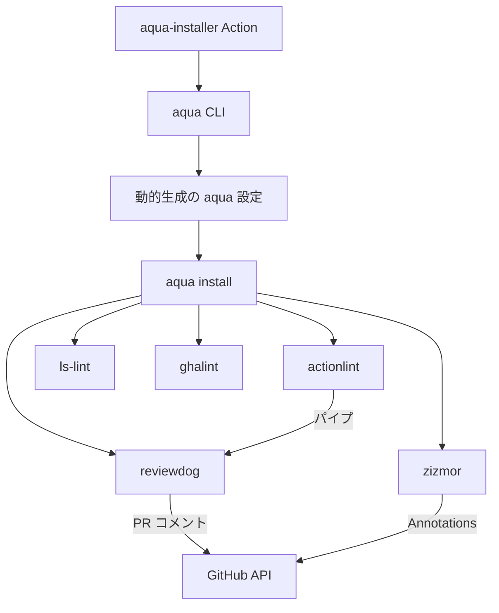
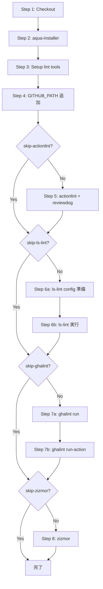

# Design Document: actions-lint "No Config" Improvement

## Overview

`actions-lint.yml` Reusable Workflow を改修し、caller 側に設定ファイル不要で動作する "no config" な RW にする。全 lint ツールのインストールを aqua に統一し、各ツールの GitHub Action は使用せず CLI を直接実行する。

現在のワークフローは 4 つの異なるインストール手段を使用している:
- `reviewdog/action-actionlint` (GitHub Action) → actionlint + reviewdog
- `ls-lint/action` (GitHub Action) → ls-lint
- `aquaproj/aqua-installer` + `aqua.yaml` → ghalint
- `astral-sh/setup-uv` + `uvx` (Python パッケージマネージャー) → zizmor

これを **aqua 一本** に統一する。

## Code Reuse Analysis

### Existing Components to Leverage
- **aquaproj/aqua-installer Action**: 既存の SHA ピン留め済み Action をそのまま使用
- **actionlint の出力フォーマット**: `{{range $err := .}}...{{end}}` テンプレートで reviewdog 互換の `%f:%l:%c: %m` フォーマットを生成
- **reviewdog の efm (errorformat)**: `%f:%l:%c: %m` パターンで actionlint 出力をパース

### Integration Points
- **GitHub Token**: `github.token` を reviewdog（PR コメント）と zizmor（online audits）に渡す
- **aqua-registry**: 全ツールのチェックサム検証とバージョン解決を担う

## Architecture

### ツール管理の統一アーキテクチャ



### ワークフロー実行フロー



## Config File Override Strategy

各ツールの設定ファイルを caller 側からオーバーライドできる仕組みを以下のとおり設計する。

### 設定解決の優先度

| ツール | CLI フラグ | 1. input 指定 | 2. 自動検出 (caller リポジトリ) | 3. デフォルト |
|--------|-----------|--------------|-------------------------------|--------------|
| actionlint | `-config-file` | `actionlint-config` input でパス指定 | ツール自身が `.github/actionlint.yaml` または `.github/actionlint.yml` を自動検出 | 設定なしで正常動作（オプション） |
| ls-lint | `--config` | `ls-lint-config` input でパス指定 | ツール自身が `.ls-lint.yml` を自動検出 | **設定なしでは fatal error** → 内蔵デフォルト config を `/tmp` に生成 |
| ghalint | `--config` / `-c` | `ghalint-config` input でパス指定 | ツール自身が `ghalint.yaml`, `.ghalint.yaml`, `.github/ghalint.yaml` (+ yml 版、計6パターン) を自動検出 | 設定なしで正常動作（全ポリシー適用） |
| zizmor | `--config` | `zizmor-config` input でパス指定 | ツール自身が `.github/zizmor.yml` (または `.yaml`)、`zizmor.yml` を自動検出（親ディレクトリも遡り検索） | 設定なしで正常動作（オプション） |

> **出典**: 各ツールの公式ドキュメントおよびソースコードから確認。

### 設計方針

- **actionlint**: input が指定された場合のみ `-config-file` フラグでパスを渡す。未指定時はフラグを付けず、ツール自身が `.github/actionlint.{yaml,yml}` を自動検出する。設定ファイルがなくても正常に動作する。
- **ghalint**: input が指定された場合のみ `-c` フラグでパスを渡す。未指定時はツール自身が `ghalint.yaml`, `.ghalint.yaml`, `.github/ghalint.yaml` 等（6パターン）を自動検出する。設定ファイルがなくても全ポリシーが適用される。
- **zizmor**: input が指定された場合のみ `--config` フラグでパスを渡す。未指定時はツール自身が `.github/zizmor.yml` 等を自動検出する。設定ファイルがなくても正常に動作する。
- **ls-lint**: 設定ファイルが見つからない場合 fatal error で停止するため、ワークフロー側で3段階のフォールバックを実装する:
  1. input が指定されている場合 → そのパスを `--config` フラグで渡す
  2. caller のリポジトリに `.ls-lint.yml` が存在する場合 → そのパスを `--config` フラグで渡す
  3. いずれも該当しない場合 → 内蔵デフォルト config を `/tmp` に動的生成して `--config` フラグで渡す

### caller 側の使用例

```yaml
# 最小構成: 全ツールがデフォルトまたは自動検出で動作
jobs:
  lint:
    uses: kryota-dev/actions/.github/workflows/actions-lint.yml@v2

# カスタム設定: caller のリポジトリにある設定ファイルを明示指定
jobs:
  lint:
    uses: kryota-dev/actions/.github/workflows/actions-lint.yml@v2
    with:
      actionlint-config: ".github/actionlint.yml"
      ls-lint-config: ".custom-ls-lint.yml"
      ghalint-config: ".ghalint.yaml"
      zizmor-config: ".zizmor.yml"
```

## Components and Interfaces

### Component 1: aqua 動的設定生成 (Step 3)

- **Purpose:** caller の `aqua.yaml` に依存せず、ワークフロー内で一時的な aqua 設定ファイルを生成して全ツールをインストールする
- **Interfaces:** `/tmp/aqua-lint.yaml` に設定ファイルを出力し、`AQUA_GLOBAL_CONFIG` 環境変数経由で aqua に渡す
- **Dependencies:** aqua-installer Action
- **Design:**

```yaml
- name: Setup lint tools via aqua
  run: |
    # renovate: datasource=github-tags depName=aquaproj/aqua-registry
    AQUA_REGISTRY_REF="v4.474.0"
    # renovate: datasource=github-releases depName=rhysd/actionlint
    ACTIONLINT_VERSION="v1.7.7"
    # renovate: datasource=github-releases depName=reviewdog/reviewdog
    REVIEWDOG_VERSION="v0.20.3"
    # renovate: datasource=github-releases depName=loeffel-io/ls-lint
    LS_LINT_VERSION="v2.3.1"
    # renovate: datasource=github-releases depName=suzuki-shunsuke/ghalint
    GHALINT_VERSION="v1.5.5"
    # renovate: datasource=github-releases depName=zizmorcore/zizmor
    ZIZMOR_VERSION="v1.7.0"

    cat > /tmp/aqua-lint.yaml << HEREDOC
    ---
    registries:
      - type: standard
        ref: ${AQUA_REGISTRY_REF}
    packages:
      - name: rhysd/actionlint@${ACTIONLINT_VERSION}
      - name: reviewdog/reviewdog@${REVIEWDOG_VERSION}
      - name: loeffel-io/ls-lint@${LS_LINT_VERSION}
      - name: suzuki-shunsuke/ghalint@${GHALINT_VERSION}
      - name: zizmorcore/zizmor@${ZIZMOR_VERSION}
    HEREDOC
    AQUA_GLOBAL_CONFIG=/tmp/aqua-lint.yaml aqua install
  shell: bash
```

**Renovate 連携**: 各バージョン行の `# renovate:` コメントにより、Renovate の customManagers (regex) が自動的にバージョン更新 PR を作成する。

**aqua パッケージ名の確認結果:**
| ツール | aqua パッケージ名 | ソース |
|--------|-------------------|--------|
| actionlint | `rhysd/actionlint` | GitHub Release |
| reviewdog | `reviewdog/reviewdog` | GitHub Release |
| ls-lint | `loeffel-io/ls-lint` | GitHub Release |
| ghalint | `suzuki-shunsuke/ghalint` | GitHub Release |
| zizmor | `zizmorcore/zizmor` | GitHub Release |

> **Note:** zizmor は `crates.io/zizmor` (Cargo ベース) も存在するが、CI では Rust ツールチェーン不要の `zizmorcore/zizmor` (GitHub Release バイナリ) を使用する。

### Component 2: actionlint + reviewdog (Step 5)

- **Purpose:** actionlint を実行し、結果を reviewdog 経由で PR コメントとして投稿する。既存の `reviewdog/action-actionlint` Action と同等の挙動を CLI で実現する。
- **Dependencies:** actionlint, reviewdog (aqua 経由でインストール済み)
- **Design:**

```yaml
- name: Run actionlint
  if: ${{ !inputs.skip-actionlint }}
  run: |
    config_flag=""
    if [[ -n "$ACTIONLINT_CONFIG" ]]; then
      config_flag="-config-file $ACTIONLINT_CONFIG"
    fi
    # shellcheck disable=SC2086
    actionlint $config_flag \
      -format '{{range $err := .}}{{$err.Filepath}}:{{$err.Line}}:{{$err.Column}}: {{$err.Message}}
    {{end}}' \
      . 2>&1 | \
      reviewdog -efm="%f:%l:%c: %m" \
        -reporter="${REVIEWDOG_REPORTER}" \
        -name=actionlint || true
  shell: bash
  env:
    REVIEWDOG_GITHUB_API_TOKEN: ${{ github.token }}
    REVIEWDOG_REPORTER: ${{ inputs.reviewdog-reporter }}
    ACTIONLINT_CONFIG: ${{ inputs.actionlint-config }}
```

**設計判断:**
- `|| true` で actionlint のエラーをジョブ失敗にしない（reviewdog が PR コメントで報告するため）
- `-format` テンプレートで改行を含む出力を生成し、reviewdog の `%f:%l:%c: %m` パターンに適合させる

### Component 3: ls-lint config 動的生成 (Step 6a-6b)

- **Purpose:** caller に `.ls-lint.yml` が不要な "no config" 体験を提供する。config の優先度: input 指定 > caller の `.ls-lint.yml` > 内蔵デフォルト
- **Dependencies:** ls-lint (aqua 経由でインストール済み)
- **Design:**

```yaml
- name: Prepare ls-lint config
  if: ${{ !inputs.skip-ls-lint }}
  id: ls-lint-config
  run: |
    if [[ -n "$LS_LINT_CONFIG_INPUT" ]]; then
      echo "config=$LS_LINT_CONFIG_INPUT" >> "$GITHUB_OUTPUT"
    elif [[ -f ".ls-lint.yml" ]]; then
      echo "config=.ls-lint.yml" >> "$GITHUB_OUTPUT"
    else
      cat > /tmp/.ls-lint-default.yml << 'HEREDOC'
    ls:
      .github/workflows:
        .yml: kebab-case
      .github/actions:
        .dir: kebab-case
        .yml: regex:action
    HEREDOC
      echo "config=/tmp/.ls-lint-default.yml" >> "$GITHUB_OUTPUT"
    fi
  shell: bash
  env:
    LS_LINT_CONFIG_INPUT: ${{ inputs.ls-lint-config }}

- name: Run ls-lint
  if: ${{ !inputs.skip-ls-lint }}
  run: ls-lint --config "${{ steps.ls-lint-config.outputs.config }}"
  shell: bash
```

**内蔵デフォルト config の設計:**
- `.github/workflows/*.yml`: kebab-case（ワークフローファイル名）
- `.github/actions/**/.dir`: kebab-case（Composite Action ディレクトリ名）
- `.github/actions/**/.yml`: `regex:action`（`action.yml` 固定名）

### Component 4: ghalint (Step 7a-7b)

- **Purpose:** ghalint による workflow と composite action のセキュリティポリシー検証
- **Dependencies:** ghalint (aqua 経由でインストール済み)
- **Design:**

```yaml
- name: Run ghalint
  if: ${{ !inputs.skip-ghalint }}
  run: |
    if [[ -n "$GHALINT_CONFIG_INPUT" ]]; then
      ghalint -c "$GHALINT_CONFIG_INPUT" run
    else
      ghalint run
    fi
  shell: bash
  env:
    GHALINT_CONFIG_INPUT: ${{ inputs.ghalint-config }}

- name: Run ghalint run-action
  if: ${{ !inputs.skip-ghalint }}
  run: |
    if [[ -n "$GHALINT_CONFIG_INPUT" ]]; then
      ghalint -c "$GHALINT_CONFIG_INPUT" run-action
    else
      ghalint run-action
    fi
  shell: bash
  env:
    GHALINT_CONFIG_INPUT: ${{ inputs.ghalint-config }}
```

### Component 5: zizmor (Step 8)

- **Purpose:** zizmor による静的セキュリティ分析。GitHub Annotations として結果を表示する。
- **Dependencies:** zizmor (aqua 経由でインストール済み)
- **Design:**

```yaml
- name: Run zizmor
  if: ${{ !inputs.skip-zizmor }}
  run: |
    config_flag=""
    if [[ -n "$ZIZMOR_CONFIG" ]]; then
      config_flag="--config $ZIZMOR_CONFIG"
    fi
    # shellcheck disable=SC2086
    zizmor --format github $config_flag .
  shell: bash
  env:
    GH_TOKEN: ${{ github.token }}
    ZIZMOR_CONFIG: ${{ inputs.zizmor-config }}
```

### Component 6: Renovate customManagers

- **Purpose:** workflow YAML 内の `# renovate:` コメントから各ツールバージョンを検出し自動更新する
- **Design:**

`.github/renovate.json5` に追加:

```json5
{
  "customManagers": [
    {
      "customType": "regex",
      "description": "Update tool versions in actions-lint.yml (aqua-managed)",
      "fileMatch": ["^\\.github/workflows/actions-lint\\.yml$"],
      "matchStrings": [
        "# renovate: datasource=(?<datasource>.*?) depName=(?<depName>.*?)\\n\\s+[A-Z_]+=\"(?<currentValue>[^\"]+)\""
      ],
      "versioningTemplate": "semver",
      "extractVersionTemplate": "^v?(?<version>.*)$"
    }
  ]
}
```

## Error Handling

### Error Scenarios

1. **aqua install 失敗**
   - **Handling:** aqua install が非ゼロで終了した場合、ジョブ全体が即座に失敗する
   - **User Impact:** ジョブ失敗として表示される。ログに aqua のエラーメッセージが含まれる

2. **actionlint エラー検出**
   - **Handling:** `|| true` で actionlint のエラーコードを無視し、reviewdog が結果を PR コメントとして投稿する
   - **User Impact:** PR に reviewdog からのコメントが表示される。ジョブ自体は成功として完了する

3. **ls-lint 命名規則違反**
   - **Handling:** ls-lint が非ゼロで終了し、ジョブが失敗する
   - **User Impact:** ジョブ失敗として表示される。エラー出力に違反ファイルが一覧表示される

4. **ghalint ポリシー違反**
   - **Handling:** ghalint が非ゼロで終了し、ジョブが失敗する
   - **User Impact:** ジョブ失敗として表示される。エラー出力にポリシー違反の詳細が含まれる

5. **zizmor セキュリティ問題検出**
   - **Handling:** `--format github` で GitHub Annotations を出力する。zizmor はデフォルトで問題検出時に非ゼロ終了する
   - **User Impact:** GitHub Annotations として各ファイルの該当行に注釈が表示される

## Testing Strategy

### CI テスト
- `my-test.yml` が `actions-lint.yml` を呼び出す既存のパターンで動作確認
- PR を作成し、以下を確認:
  - 全ツールが aqua 経由で正常にインストールされること
  - actionlint + reviewdog が PR コメントを正しく投稿すること
  - ls-lint のデフォルト config で命名規則チェックが動作すること
  - ghalint run / ghalint run-action が正常完了すること
  - zizmor が GitHub Annotations を正しく出力すること

### ローカル検証
- `actionlint` で生成した workflow YAML の構文チェック
- YAML 構文の手動レビュー

## Breaking Changes

| 変更 | 影響 | 移行方法 |
|------|------|---------|
| `aqua-version` input 削除 | caller が指定していた場合にエラー | input を削除するだけ |
| 各 Action → CLI 直接実行 | 出力形式が微妙に変わる可能性 | CLI で同等フォーマットを指定済み |

メジャーバージョンアップ (v1 → v2) として扱う。
