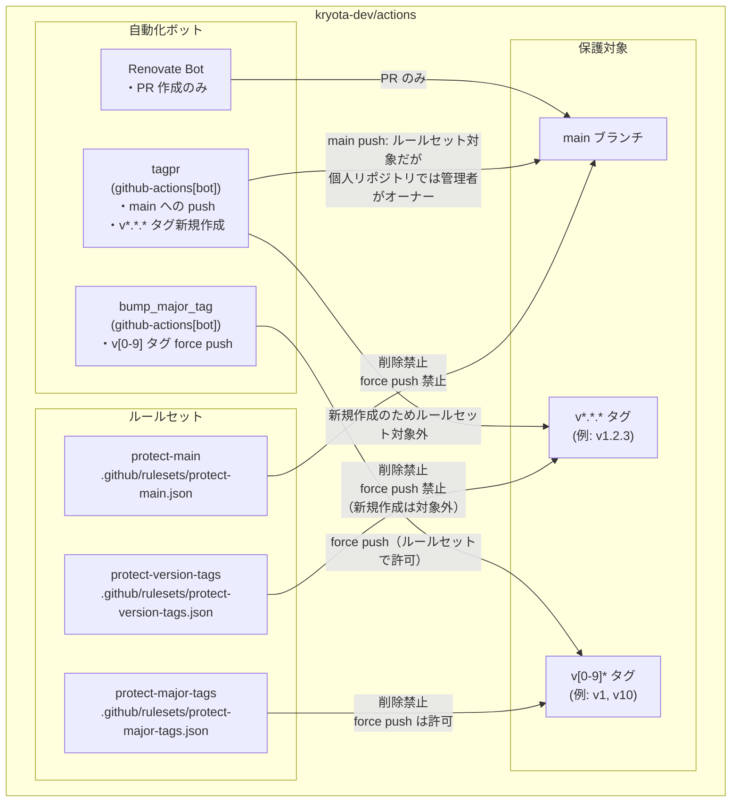
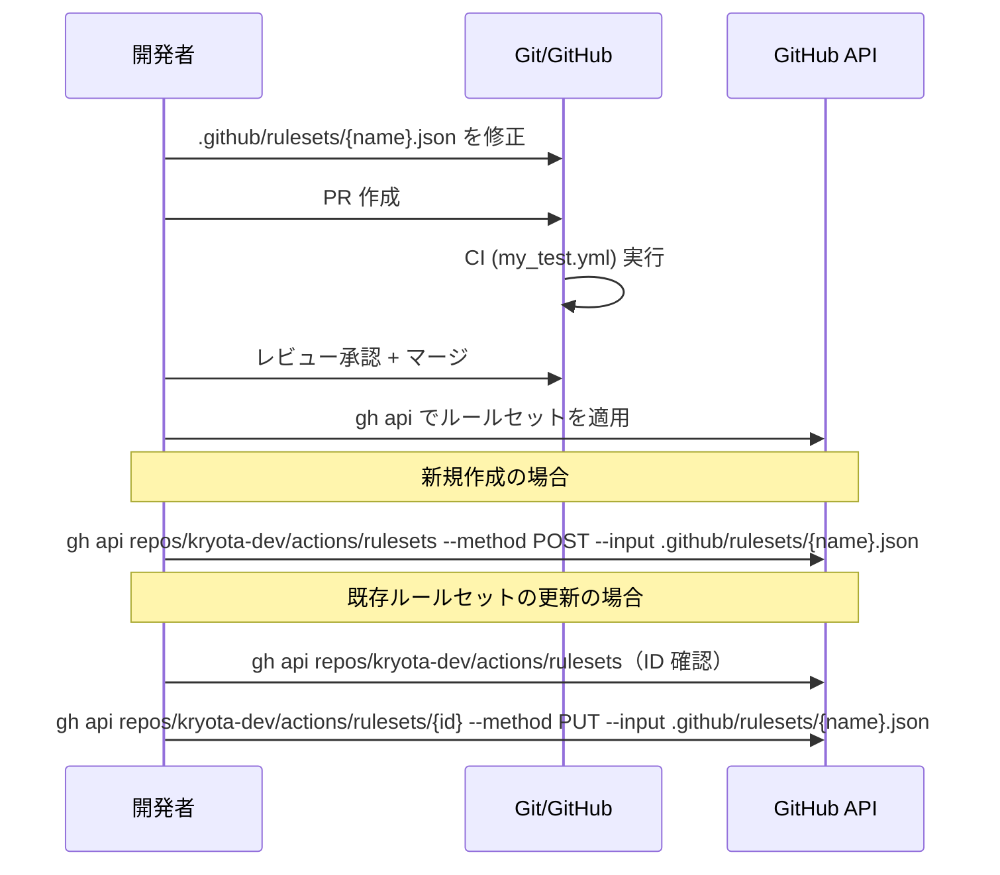

# Design Document

## Overview

`kryota-dev/actions` リポジトリに GitHub Repository Rulesets を導入する。3 つのルールセットを JSON ファイルとしてリポジトリ内でバージョン管理し、`gh api` または GitHub UI 経由でインポートして適用する。

このドキュメントでは、個人リポジトリ固有の制約（バイパスアクターに App を追加不可）を前提とした設計を示す。

## Steering Document Alignment

### 技術的制約の確認

| 項目 | 内容 |
|------|------|
| リポジトリ種別 | 個人リポジトリ（`kryota-dev/actions`） |
| SHA ピン留め | 全 `uses:` を 40 文字 SHA でピン留め必須（ghalint, zizmor で CI 検証） |
| 権限最小化 | トップレベル `permissions: {}` + ジョブごとに必要最小限 |
| 命名規則 | Workflow ファイルは `snake_case.yml`、ADR は `NNN-kebab-case-title.md` |
| ファイル格納 | ルールセット JSON は `.github/rulesets/` |

### 既存コードとの整合性

- `my_release.yml`: `tagpr` ジョブ（contents: write）+ `bump_major_tag` ジョブ（contents: write）が main への push と vX タグの force push を実行
- `my_test.yml`: `lint` ジョブ（PR, merge_group トリガー）→ ステータスチェック名 `lint`
- `my_codeql.yml`: `analyze` ジョブ（PR, push to main, merge_group トリガー）→ ステータスチェック名 `analyze`

## 個人リポジトリにおけるバイパスアクターの制約

### 重要な制約

GitHub の公式ドキュメントには以下の記載がある:

> "Actors may only be added to bypass lists when the repository belongs to an organization."

**個人リポジトリ（`kryota-dev/actions`）では、ルールセットのバイパスリストに特定のアクター（App、Team 等）を追加できない。**

これにより、当初想定していた「`github-actions[bot]` をバイパスアクターとして登録し main への直接 push を許可する」設計は実現不可能である。

### 制約への対応方針

個人リポジトリでの選択肢:

| 方法 | 概要 | tagpr との適合性 |
|------|------|----------------|
| A. バイパスアクター不使用・ルールセットを適用しない | ルールセット自体を導入しない | tagpr に影響なし（現状維持） |
| B. PR 必須ルールのみ適用（バイパスなし） | main への直接 push を全員に禁止 | tagpr がブロックされる（×） |
| C. ステータスチェック + タグ保護のみ適用 | PR 必須化は行わず、タグ保護とステータスチェックに限定 | tagpr に影響なし（推奨） |
| D. Deploy Key をバイパスアクターとして使用 | Deploy Key を発行しルールセットで bypass 許可 | 可能だが管理コストが高い |

### 採用方針: C（段階的保護）

**現実的かつ影響範囲が最小な方針 C を採用する。**

- `protect-main` ルールセット: PR 必須化は**行わない**。代わりにステータスチェック必須化のみ（ただし個人リポジトリではステータスチェック単体の効果が限定的なため、タグ保護を優先する）
- `protect-version-tags` ルールセット: `v*.*.*` タグの削除・force push を禁止（tagpr の新規タグ作成は影響なし）
- `protect-major-tags` ルールセット: `v[0-9]` タグの削除は禁止するが、**force push は許可**（`bump_major_tag` ジョブのため）

> **注記**: 個人リポジトリでは管理者（リポジトリオーナーである人間のアカウント）は常にルールセットをバイパスできる。ただし `GITHUB_TOKEN` で動作する `github-actions[bot]` は管理者権限を持たない別のアクターであるため、tagpr・`bump_major_tag` ジョブはルールセットの制限を受ける。`protect-main` の `non_fast_forward` ルールは tagpr の通常の fast-forward push には影響しないが、異常時にブロックされる可能性がある点に注意する。また、**タグの新規作成はルールセットの保護対象外**であるため、tagpr による vX.Y.Z タグの新規作成はブロックされない。

## Architecture

### ルールセット構成



### リポジトリファイル構成

```
.github/
└── rulesets/
    ├── protect-main.json          # main ブランチ保護ルールセット
    ├── protect-version-tags.json  # vX.Y.Z タグ保護ルールセット
    └── protect-major-tags.json    # vX タグ保護ルールセット
docs/
└── adr/
    └── 003-branch-ruleset.md     # 設計判断の記録
```

## ルールセット詳細設計

### Ruleset 1: protect-main

**目的**: main ブランチの意図しない削除・force push を防止する。

| 設定項目 | 値 | 理由 |
|---------|---|------|
| 対象 | `main` ブランチ | デフォルトブランチ・リリースブランチ |
| enforcement | `active` | 即時有効 |
| 削除禁止 | `true` | main の誤削除を防止 |
| force push 禁止 | `true` | 履歴の書き換えを防止 |
| PR 必須化 | **なし** | 個人リポジトリではバイパス設定不可のため tagpr がブロックされる |
| ステータスチェック | **なし** | 個人リポジトリでは PR 必須化なしではステータスチェックのみ設定しても効果が限定的 |
| バイパスアクター | **なし** | 個人リポジトリでは設定不可 |

**JSON スキーマ**:

```json
{
  "name": "protect-main",
  "target": "branch",
  "enforcement": "active",
  "conditions": {
    "ref_name": {
      "include": ["refs/heads/main"],
      "exclude": []
    }
  },
  "rules": [
    {
      "type": "deletion"
    },
    {
      "type": "non_fast_forward"
    }
  ],
  "bypass_actors": []
}
```

> **`deletion` ルール**: 対象ブランチの削除を禁止する。
> **`non_fast_forward` ルール**: force push（非 fast-forward push）を禁止する。

---

### Ruleset 2: protect-version-tags

**目的**: リリースタグ（`v*.*.*`）の削除・改ざんを防止し、外部リポジトリが参照する Workflow バージョンの信頼性を確保する。

| 設定項目 | 値 | 理由 |
|---------|---|------|
| 対象 | `v*.*.*` パターン（タグ） | tagpr が作成するリリースタグ |
| enforcement | `active` | 即時有効 |
| 削除禁止 | `true` | リリースタグの消失を防止 |
| force push 禁止 | `true` | タグの内容改ざんを防止 |
| バイパスアクター | **なし** | 個人リポジトリでは設定不可。タグ新規作成はこのルールの対象外のため tagpr に影響なし |

**JSON スキーマ**:

```json
{
  "name": "protect-version-tags",
  "target": "tag",
  "enforcement": "active",
  "conditions": {
    "ref_name": {
      "include": ["refs/tags/v*.*.*"],
      "exclude": []
    }
  },
  "rules": [
    {
      "type": "deletion"
    },
    {
      "type": "non_fast_forward"
    }
  ],
  "bypass_actors": []
}
```

> **重要**: GitHub Rulesets の `deletion` および `non_fast_forward` ルールは**既存の ref の削除・更新**を対象とする。**新規タグの作成はこれらのルールでは禁止されない**。tagpr が新たに `v1.2.3` タグを作成する操作は保護対象外であるため、リリースフローはブロックされない。
>
> **fnmatch 仕様の確認**: GitHub Rulesets の ref_name パターンは `File::FNM_PATHNAME` フラグ付きの fnmatch を使用する。`*` ワイルドカードは `/`（スラッシュ）以外の任意の文字列にマッチし、`.`（ドット）を含む文字列にもマッチする。したがって `refs/tags/v*.*.*` は `refs/tags/v1.2.3` に正しくマッチすることが GitHub 公式ドキュメントで確認されている。`protect-major-tags` の `refs/tags/v[0-9]*` との重複適用については、`v1.2.3` 形式のタグは `refs/tags/v[0-9]*` にもマッチするが、両ルールセットの削除禁止・force push 禁止の重複適用は問題ない（実質的に同一の効果）。

---

### Ruleset 3: protect-major-tags

**目的**: メジャータグ（`v1`, `v2` 等）の誤削除を防止しつつ、`bump_major_tag` ジョブによる force push を許可する。

| 設定項目 | 値 | 理由 |
|---------|---|------|
| 対象 | `v[0-9]*` パターン（タグ） | bump_major_tag が管理するメジャータグ（v10 以上に対応） |
| enforcement | `active` | 即時有効 |
| 削除禁止 | `true` | メジャータグの誤削除を防止 |
| force push 禁止 | **なし（適用しない）** | `bump_major_tag` ジョブが force push を必要とするため |
| バイパスアクター | **なし** | 個人リポジトリでは設定不可。force push ルール自体を除外することで対応 |

**JSON スキーマ**:

```json
{
  "name": "protect-major-tags",
  "target": "tag",
  "enforcement": "active",
  "conditions": {
    "ref_name": {
      "include": ["refs/tags/v[0-9]*"],
      "exclude": []
    }
  },
  "rules": [
    {
      "type": "deletion"
    }
  ],
  "bypass_actors": []
}
```

> **パターン設計の注記**: `refs/tags/v[0-9]*` は `v1`, `v2`, ..., `v10`, `v99` に加え、`v1.2.3` 形式（`protect-version-tags` 対象）にもマッチする。ただし、両ルールセットが同一タグに重複適用される場合（例: `v1` が `refs/tags/v*.*.*` にはマッチしない一方、`refs/tags/v[0-9]*` にはマッチする）、重複の削除禁止ルールの適用は問題ない（効果が合算されるが実質的に同一）。なお `refs/tags/v[0-9]`（旧パターン）は v10 以上に対応できないため、`v[0-9]*` に変更した。

> **`non_fast_forward` ルールを除外する理由**: `bump_major_tag` ジョブ（`my_release.yml`）は `git push origin "$MAJOR" --force` で vX タグを force push する。個人リポジトリではバイパスアクターを設定できないため、force push ルール自体を除外することで `bump_major_tag` の動作を維持する。

## ADR 設計: 003-branch-ruleset.md

ADR は `npm run adr:new -- "Branch ruleset"` コマンドで作成し、`docs/adr/003-branch-ruleset.md` に格納する。

### ADR 内容の骨子

```markdown
# 3. Branch ruleset

Date: YYYY-MM-DD

## Status

YYYY-MM-DD accepted

## Context

- Repository kryota-dev/actions manages reusable GitHub Actions workflows.
- External repos reference workflows via tags (e.g., v1.2.3, v1).
- Tools involved: tagpr (releases via github-actions[bot]), bump_major_tag (force-pushes vX tags), Renovate Bot (PR only).
- Personal repository constraint: bypass actors cannot be added to ruleset bypass lists.
- Goal: protect main branch and tags without breaking automated release flow.

## Decision

Adopt three rulesets managed as JSON files in .github/rulesets/:

1. protect-main: Prevents deletion and force push of main branch. PR requirement omitted because bypass actors are unavailable on personal repositories, which would block tagpr.

2. protect-version-tags: Prevents deletion and force push of vX.Y.Z tags. New tag creation (used by tagpr) is not subject to these rules.

3. protect-major-tags: Prevents deletion of vX tags. Force push rule is intentionally excluded to allow bump_major_tag workflow to update major tags.

Ruleset JSON files are version-controlled in .github/rulesets/ and applied via gh api or GitHub UI import.

## Consequences

- tagpr release flow (main push → release PR → merge → tag) is unaffected.
- bump_major_tag force push to vX tags is permitted.
- Renovate Bot PR-only workflow is unaffected.
- PR requirement for main is NOT enforced; this is a known limitation of personal repositories.
- Ruleset changes follow: edit JSON → PR review → merge → manual gh api import.
- If the repository is transferred to an organization, bypass actors (github-actions[bot])
  can be added to ruleset bypass lists, enabling PR requirement enforcement for main.
```

## 変更管理フロー

### JSON ファイルの適用手順



### 適用コマンド

```bash
# ルールセット一覧と ID 確認
gh api repos/kryota-dev/actions/rulesets

# 新規作成
gh api repos/kryota-dev/actions/rulesets \
  --method POST \
  --input .github/rulesets/protect-main.json

gh api repos/kryota-dev/actions/rulesets \
  --method POST \
  --input .github/rulesets/protect-version-tags.json

gh api repos/kryota-dev/actions/rulesets \
  --method POST \
  --input .github/rulesets/protect-major-tags.json

# 既存ルールセットの更新（{ruleset_id} を実際の ID に置き換える）
gh api repos/kryota-dev/actions/rulesets/{ruleset_id} \
  --method PUT \
  --input .github/rulesets/protect-main.json
```

## Code Reuse Analysis

### 既存コードの活用

このフィーチャーはコードではなくインフラ設定のため、既存コードの再利用は限定的。

| 既存要素 | 活用方法 |
|---------|---------|
| `my_release.yml` の `bump_major_tag` ジョブ | protect-major-tags から `non_fast_forward` ルールを除外する根拠として参照 |
| `my_test.yml` の `lint` ジョブ | 将来的にステータスチェック必須化を行う場合のチェック名（`lint`）として参照 |
| `my_codeql.yml` の `analyze` ジョブ | 同上（`analyze`） |
| `docs/adr/` の既存 ADR | 命名規則・フォーマットの参照元 |
| `npm run adr:new` コマンド | ADR ファイルの生成に使用 |

## Error Handling

### エラーシナリオ

1. **tagpr が main への push でブロックされた場合**
   - 原因: `non_fast_forward` ルールが tagpr の push をブロック。通常 tagpr は fast-forward push を行うが、タイミングによっては non-fast-forward になる可能性がある
   - 重要: `github-actions[bot]`（tagpr）はリポジトリオーナーとは異なる別のアクターであり、管理者バイパスは適用されない
   - 対処手順:
     1. GitHub UI の Settings > Rules > Rulesets で `protect-main` を開く
     2. `enforcement` を `disabled` に変更してルールセットを一時無効化する
     3. tagpr のログを確認し、push が non-fast-forward になった原因を調査する
     4. 原因が解消されたら `enforcement` を `active` に戻す
     5. 根本解決が困難な場合は、`protect-main` の JSON から `non_fast_forward` ルールを削除して `gh api` で再インポートする
   - 確認: tagpr は `GITHUB_TOKEN` を使用するため、リポジトリオーナー（個人アカウント）でのルールセット確認が必要

2. **`bump_major_tag` が vX タグの force push でブロックされた場合**
   - 原因: `protect-major-tags` に誤って `non_fast_forward` ルールが含まれている
   - 対応: JSON から `non_fast_forward` ルールを削除して再インポート

3. **`gh api` インポートで 422 エラーが発生した場合**
   - 原因: JSON スキーマの不正（必須フィールドの欠落等）
   - 対応: `conditions.ref_name.include` の形式、`rules` 各エントリの `type` フィールドを確認

4. **ルールセットが期待通りに動作しない場合**
   - 対応: GitHub UI の Settings > Rules > Rulesets でルールセットの状態を確認。`enforcement` が `active` であることを確認

## Testing Strategy

### 検証手順

ルールセット適用後に以下を確認する（コード的なテストではなく、手動または CI での動作確認）。

#### 単体検証

| 検証項目 | 検証方法 | 期待結果 |
|---------|---------|---------|
| main への直接 push（一般ユーザー） | `git push origin main`（一般コミット） | `non_fast_forward` により拒否（force push 時） |
| main の削除 | `git push origin --delete main` | `deletion` ルールにより拒否 |
| `v1.2.3` タグの削除 | `git push origin --delete v1.2.3` | `deletion` ルールにより拒否 |
| `v1.2.3` タグの force push | `git push origin v1.2.3 --force` | `non_fast_forward` ルールにより拒否 |
| `v1.2.3` タグの新規作成 | `git tag v9.9.9 && git push origin v9.9.9` | 許可（新規作成はルール対象外） |
| `v1` タグの削除 | `git push origin --delete v1` | `deletion` ルールにより拒否 |
| `v1` タグの force push | `git push origin v1 --force` | 許可（`non_fast_forward` ルールなし） |

#### 統合検証（リリースフロー）

1. `my_release.yml` のテスト実行（main への push）→ tagpr がリリース PR を作成できることを確認
2. リリース PR のマージ → tagpr が vX.Y.Z タグを新規作成できることを確認
3. `bump_major_tag` ジョブ → vX タグへの force push が成功することを確認
4. Renovate Bot の PR 作成 → PR が正常に作成・更新できることを確認

### ルールセット JSON の検証

```bash
# 適用後、ルールセットが正しく設定されているか確認
gh api repos/kryota-dev/actions/rulesets | python3 -m json.tool

# 特定ルールセットの詳細確認
gh api repos/kryota-dev/actions/rulesets/{ruleset_id} | python3 -m json.tool
```
