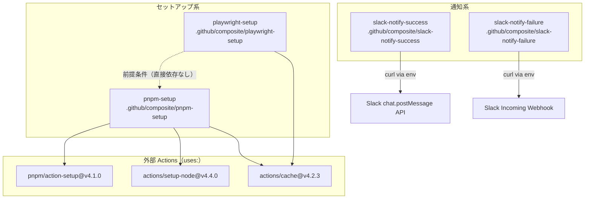
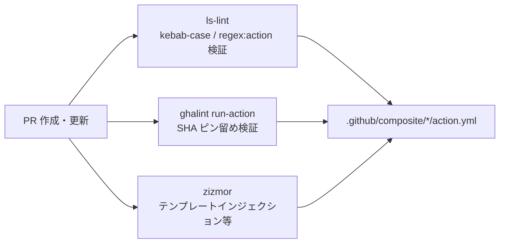

# Design Document

## Overview

本ドキュメントは、`kryota-dev/actions` リポジトリに **4つの Composite Actions** を実装するための技術設計を定義する。

実装対象の Composite Actions:

| Action名 | 格納パス | 用途 |
|---|---|---|
| `pnpm-setup` | `.github/composite/pnpm-setup/action.yml` | Node.js・pnpm セットアップ（ストアキャッシュ付き） |
| `playwright-setup` | `.github/composite/playwright-setup/action.yml` | Playwright ブラウザのキャッシュ付きインストール |
| `slack-notify-success` | `.github/composite/slack-notify-success/action.yml` | 成功通知（Bot OAuth Token + chat.postMessage API） |
| `slack-notify-failure` | `.github/composite/slack-notify-failure/action.yml` | 失敗通知（Incoming Webhook URL 方式） |

加えて、以下のドキュメント更新を行う:
- `README.md`: 各 Action の使用方法・入力パラメータ一覧を `### Composite Actions` セクションに追記
- `.github/composite/.gitkeep`: 実際の Action 追加に伴い削除

## Steering Document Alignment

### 技術基準

- `uses:` は full commit SHA（40文字）でピン留め（`ghalint run-action` / `zizmor` で CI 検証）
- SHA のコメントにはタグ名を記載（例: `# v4.1.0`）
- Renovate Bot により SHA を自動更新（`renovate.json5` の `helpers:pinGitHubActionDigests` により `.github/composite/` 配下の `action.yml` も自動対象）
- `inputs` の値を `run` ステップへ直接埋め込まず、`env:` 経由で環境変数として渡す（テンプレートインジェクション対策）
- `run` ステップには必ず `shell: bash` を明記

### プロジェクト構造規約

- Composite Actions は `.github/composite/` 配下に配置（actionlint の誤検知を回避）
- ディレクトリ名は kebab-case（ls-lint で強制: `.dir: kebab-case`）
- ファイル名は `action.yml` のみ許可（ls-lint で強制: `.yml: regex:action`）

## Code Reuse Analysis

### 既存コンポーネントの活用

| コンポーネント | 活用方法 |
|---|---|
| `aqua.yaml` の `ghalint@v1.5.5` | `ghalint run-action` は v1.5.1 以降でサポート済み。追加設定不要 |
| `my-test.yml` の `ghalint run-action` ステップ | 既存ステップが `.github/composite/` 配下の `action.yml` を自動検証する |
| `renovate.json5` の `helpers:pinGitHubActionDigests` | `.github/composite/` 配下の `action.yml` 内の `uses:` も追加設定不要で自動更新対象 |
| `uvx zizmor --format=github .` | リポジトリルート指定のため `.github/composite/` 配下も自動スキャン対象 |
| `.ls-lint.yml` の `.github/composite` ルール | kebab-case ディレクトリ名と `action.yml` ファイル名を既に強制中 |

### 変更が必要なファイル

| ファイル | 変更種別 | 変更内容 |
|---|---|---|
| `.github/composite/pnpm-setup/action.yml` | 新規作成 | pnpm-setup Composite Action |
| `.github/composite/playwright-setup/action.yml` | 新規作成 | playwright-setup Composite Action |
| `.github/composite/slack-notify-success/action.yml` | 新規作成 | slack-notify-success Composite Action |
| `.github/composite/slack-notify-failure/action.yml` | 新規作成 | slack-notify-failure Composite Action |
| `.github/composite/.gitkeep` | 削除 | 実際の Action 追加後は不要 |
| `README.md` | 修正 | `### Composite Actions` セクションに各 Action の詳細を追記 |

## Architecture

### ディレクトリ構造（To-Be）

```
.github/
  composite/
    pnpm-setup/
      action.yml          # Node.js・pnpm セットアップ
    playwright-setup/
      action.yml          # Playwright ブラウザキャッシュ付きインストール
    slack-notify-success/
      action.yml          # Slack 成功通知（Bot OAuth Token）
    slack-notify-failure/
      action.yml          # Slack 失敗通知（Incoming Webhook）
    .gitkeep              # 削除（Action 追加後は不要）
  workflows/
    my-test.yml           # 変更なし（ghalint run-action は既存済み）
    my-setup-pr.yml       # 変更なし
    my-release.yml        # 変更なし
    my-codeql.yml         # 変更なし
README.md                 # 変更: Composite Actions セクション更新
```

### Action 間の依存関係



### CI パイプラインとの関係



## Components and Interfaces

### Component 1: pnpm-setup

- **Purpose:** Node.js と pnpm のセットアップ、pnpm ストアキャッシュ、依存関係インストールを一括実行する
- **Inputs:** なし（リポジトリルートの `.node-version`・`package.json`・`pnpm-lock.yaml` を参照）
- **Outputs:** なし
- **Dependencies:**
  - `pnpm/action-setup@a7487c7e89a18df4991f7f222e4898a00d66ddda` (v4.1.0)
  - `actions/setup-node@49933ea5288caeca8642d1e84afbd3f7d6820020` (v4.4.0)
  - `actions/cache@5a3ec84eff668545956fd18022155c47e93e2684` (v4.2.3)
- **設計判断:** inputs を設けないシンプルな設計とする。`package_json_file`・`.node-version`・`pnpm-lock.yaml` のパスカスタマイズは過度な汎用化になるため現時点では対象外とする

**ステップ構成:**

1. `pnpm/action-setup` で pnpm インストール（`run_install: false`）
2. `actions/setup-node` で Node.js インストール（`node-version-file: .node-version`、`cache: 'pnpm'`）
3. `run` で `pnpm store path --silent` を取得して `$GITHUB_ENV` の `STORE_PATH` に設定
4. `actions/cache` で pnpm ストアをキャッシュ（キー: `{runner.os}-pnpm-store-{hash(pnpm-lock.yaml)}`）
5. `run` で `pnpm install` 実行

---

### Component 2: playwright-setup

- **Purpose:** Playwright ブラウザをキャッシュ付きでインストールし、CI の実行時間を短縮する
- **Inputs:** なし
- **Outputs:** なし（内部ステップ出力 `version` は `$GITHUB_OUTPUT` 経由で `actions/cache` の key に使用）
- **Dependencies:**
  - `actions/cache@5a3ec84eff668545956fd18022155c47e93e2684` (v4.2.3)
- **前提条件:** 呼び出し前に `pnpm-setup`（または同等）が完了していること
- **設計判断:** `actions/cache` のキャッシュヒット時は `pnpm exec playwright install --with-deps` をスキップするため、明示的な `if: steps.cache-playwright.outputs.cache-hit != 'true'` 条件をインストールステップに付与する

**ステップ構成:**

1. `run` で `pnpm exec playwright --version` を実行し、`sed` でバージョン番号のみを抽出して `$GITHUB_OUTPUT` に `version` として書き出す（`id: playwright-version`）
2. `actions/cache` でブラウザキャッシュ（パス: `~/.cache/ms-playwright`、キー: `{runner.os}-playwright-{steps.playwright-version.outputs.version}`）（`id: cache-playwright`）
3. `run` で `pnpm exec playwright install --with-deps` を実行（`if: steps.cache-playwright.outputs.cache-hit != 'true'`）

---

### Component 3: slack-notify-success

- **Purpose:** ワークフロー成功時に Slack の `chat.postMessage` API（Bot OAuth Token 認証）へ通知を送信する
- **Inputs:** `channel-id`（必須）、`bot-oauth-token`（必須）、`color`（任意）、`mention-user`（任意）、`title`（任意）、`message`（任意）、`thread-ts`（任意）、`reply-broadcast`（任意）
- **Outputs:** なし
- **Dependencies:** 外部 Action なし（`curl` と `jq` を使用。`jq` は ubuntu-latest に標準搭載）
- **設計判断:**
  - 全入力値および `runner.debug` を `env:` 経由で渡してテンプレートインジェクションを回避する（`runner.debug` はユーザー入力ではないが、ポリシーの一貫性のため `RUNNER_DEBUG` 環境変数として渡す）
  - `thread_ts` は文字列 `'null'` をデフォルト値とし、シェルスクリプト内で `if [ "${SLACK_THREAD_TS}" != 'null' ]` により条件分岐する
  - JSON 構築に `jq` を使用し、ユーザー入力値（`mention-user`、`title`、`message` 等）のダブルクォートやバックスラッシュによる JSON 破損を防ぐ（JSONインジェクション対策）
  - `curl --max-time 30 -sS` でタイムアウト設定・レスポンスを変数に格納し、HTTP エラー（ネットワーク失敗）と Slack API の論理エラー（`"ok":false`）の両方を検出する
  - Slack の `chat.postMessage` API は HTTP 200 でも `"ok":false` を返す場合があるため、`grep '"ok":false'` でレスポンスを検証する

**ステップ構成:**

1. `run` ステップ（`id: post-message-success`）:
   - `env:` で全 inputs および `runner.debug`（`RUNNER_DEBUG`）を環境変数にマップ
   - `RUNNER_DEBUG == '1'` のとき `set -x` を実行
   - `mention-user` の有無でタイトル文字列を分岐
   - `jq -n` で JSON を安全に構築（`--arg` で文字列エスケープ）
   - `thread_ts != 'null'` のとき `jq` の `--arg`・`--argjson` で `thread_ts`・`reply_broadcast` フィールドを追加
   - `curl` レスポンスを `RESPONSE` 変数に格納し、ネットワーク失敗時と `"ok":false` 時にそれぞれエラー終了する

---

### Component 4: slack-notify-failure

- **Purpose:** ワークフロー失敗時に Slack の Incoming Webhook URL へ通知を送信する
- **Inputs:** `webhook-url`（必須）、`color`（任意）、`mention-user`（任意）、`title`（任意）、`message`（任意）
- **Outputs:** なし
- **Dependencies:** 外部 Action なし（`curl` と `jq` を使用。`jq` は ubuntu-latest に標準搭載）
- **設計判断:**
  - `slack-notify-success` との違い: チャンネル指定不要、Bot OAuth Token の代わりに Webhook URL を使用、`thread_ts` / `reply-broadcast` は Incoming Webhook でサポートされないため inputs に含めない
  - 全入力値および `runner.debug` を `env:` 経由で渡してテンプレートインジェクションを回避する（`RUNNER_DEBUG` 環境変数として渡す）
  - JSON 構築に `jq` を使用し、ユーザー入力値による JSON 破損を防ぐ（JSONインジェクション対策）
  - Incoming Webhook は HTTP ステータスコードでエラーを返すため、`curl --max-time 30 --fail -sS` で十分。`--fail` オプションにより HTTP エラー時に非ゼロ終了となる

**ステップ構成:**

1. `run` ステップ（`id: post-message-failure`）:
   - `env:` で全 inputs および `runner.debug`（`RUNNER_DEBUG`）を環境変数にマップ
   - `RUNNER_DEBUG == '1'` のとき `set -x` を実行
   - `mention-user` の有無でタイトル文字列を分岐
   - `jq -n` で JSON を安全に構築（`--arg` で文字列エスケープ）
   - `curl --fail` で Incoming Webhook URL へ POST（HTTP エラー時は自動的に非ゼロ終了）

## Data Models

### pnpm-setup / action.yml

```yaml
name: Setup pnpm
description: Setup Node.js and pnpm, and install dependencies

runs:
  using: 'composite'
  steps:
    - uses: pnpm/action-setup@a7487c7e89a18df4991f7f222e4898a00d66ddda # v4.1.0
      name: Install pnpm
      with:
        package_json_file: package.json
        run_install: false

    - name: Install Node.js
      uses: actions/setup-node@49933ea5288caeca8642d1e84afbd3f7d6820020 # v4.4.0
      with:
        node-version-file: .node-version
        cache: 'pnpm'

    - name: Get pnpm store directory
      shell: bash
      run: |
        echo "STORE_PATH=$(pnpm store path --silent)" >> "$GITHUB_ENV"

    - uses: actions/cache@5a3ec84eff668545956fd18022155c47e93e2684 # v4.2.3
      name: Setup pnpm cache
      with:
        path: ${{ env.STORE_PATH }}
        key: ${{ runner.os }}-pnpm-store-${{ hashFiles('**/pnpm-lock.yaml') }}
        restore-keys: |
          ${{ runner.os }}-pnpm-store-

    - name: Install dependencies
      shell: bash
      run: pnpm install
```

### playwright-setup / action.yml

```yaml
name: Setup Playwright
description: Setup Playwright browsers with caching

runs:
  using: 'composite'
  steps:
    - name: Get Playwright version
      id: playwright-version
      shell: bash
      run: |
        PLAYWRIGHT_VERSION=$(pnpm exec playwright --version | sed 's/Version //')
        echo "version=$PLAYWRIGHT_VERSION" >> "$GITHUB_OUTPUT"

    - name: Cache Playwright browsers
      id: cache-playwright
      uses: actions/cache@5a3ec84eff668545956fd18022155c47e93e2684 # v4.2.3
      with:
        path: ~/.cache/ms-playwright
        key: ${{ runner.os }}-playwright-${{ steps.playwright-version.outputs.version }}

    - name: Install Playwright browsers
      if: steps.cache-playwright.outputs.cache-hit != 'true'
      shell: bash
      run: pnpm exec playwright install --with-deps
```

### slack-notify-success / action.yml

```yaml
name: Post Message to Slack - Success
description: Post a message to Slack when the workflow succeeds

inputs:
  channel-id:
    description: Slack Channel ID
    required: true
  bot-oauth-token:
    description: Slack Bot OAuth Token
    required: true
  color:
    description: Color of the message
    required: false
    default: good
  mention-user:
    description: Mention user
    required: false
    default: ''
  title:
    description: Message title
    required: false
    default: 'workflow execution completed'
  message:
    description: Message body
    required: false
    default: 'Execution log: ${{ github.server_url }}/${{ github.repository }}/actions/runs/${{ github.run_id }}'
  thread-ts:
    description: Thread timestamp for reply
    required: false
    default: 'null'
  reply-broadcast:
    description: Whether to broadcast the reply to the channel
    required: false
    default: 'false'

runs:
  using: 'composite'
  steps:
    - id: post-message-success
      shell: bash
      env:
        SLACK_CHANNEL_ID: ${{ inputs.channel-id }}
        SLACK_BOT_OAUTH_TOKEN: ${{ inputs.bot-oauth-token }}
        SLACK_COLOR: ${{ inputs.color }}
        SLACK_MENTION_USER: ${{ inputs.mention-user }}
        SLACK_TITLE_TEXT: ${{ inputs.title }}
        SLACK_MESSAGE: ${{ inputs.message }}
        SLACK_THREAD_TS: ${{ inputs.thread-ts }}
        SLACK_REPLY_BROADCAST: ${{ inputs.reply-broadcast }}
        RUNNER_DEBUG: ${{ runner.debug }}
      run: |
        if [ "${RUNNER_DEBUG}" == "1" ]; then
          set -x
        fi
        if [ -n "${SLACK_MENTION_USER}" ]; then
          SLACK_TITLE="*SUCCESS - ${SLACK_MENTION_USER} ${SLACK_TITLE_TEXT}*"
        else
          SLACK_TITLE="*SUCCESS - ${SLACK_TITLE_TEXT}*"
        fi
        REPO_NAME="${GITHUB_REPOSITORY#${GITHUB_REPOSITORY_OWNER}/}"
        REPO_URL="${GITHUB_SERVER_URL}/${GITHUB_REPOSITORY}"
        # jq で JSON を安全に構築（ユーザー入力値のエスケープ対策）
        SLACK_DATA=$(jq -n \
          --arg channel "${SLACK_CHANNEL_ID}" \
          --arg color "${SLACK_COLOR}" \
          --arg title "${SLACK_TITLE}" \
          --arg author_name "${REPO_NAME}" \
          --arg author_link "${REPO_URL}" \
          --arg text "${SLACK_MESSAGE}" \
          --arg thread_ts "${SLACK_THREAD_TS}" \
          --argjson reply_broadcast "${SLACK_REPLY_BROADCAST}" \
          'def base:
            {
              channel: $channel,
              attachments: [{
                fallback: $title,
                pretext: $title,
                color: $color,
                author_name: $author_name,
                author_link: $author_link,
                text: $text
              }]
            };
          if $thread_ts != "null" then
            base + {thread_ts: $thread_ts, reply_broadcast: $reply_broadcast}
          else
            base
          end')
        RESPONSE=$(curl --max-time 30 -sS -X POST \
          -H "Content-Type: application/json" \
          -H "Authorization: Bearer ${SLACK_BOT_OAUTH_TOKEN}" \
          -d "${SLACK_DATA}" \
          "https://slack.com/api/chat.postMessage") \
          || { echo "::error::Failed to post message to Slack (network error)"; exit 1; }
        if echo "${RESPONSE}" | grep -q '"ok":false'; then
          echo "::error::Slack API returned error: ${RESPONSE}"
          exit 1
        fi
```

### slack-notify-failure / action.yml

```yaml
name: Post Message to Slack - Failure
description: Post a message to Slack when the workflow fails

inputs:
  webhook-url:
    description: Slack Incoming Webhook URL
    required: true
  color:
    description: Color of the message
    required: false
    default: danger
  mention-user:
    description: Mention user
    required: false
    default: ''
  title:
    description: Message title
    required: false
    default: 'workflow failed'
  message:
    description: Message body
    required: false
    default: 'Execution log: ${{ github.server_url }}/${{ github.repository }}/actions/runs/${{ github.run_id }}'

runs:
  using: 'composite'
  steps:
    - id: post-message-failure
      shell: bash
      env:
        SLACK_WEBHOOK_URL: ${{ inputs.webhook-url }}
        SLACK_COLOR: ${{ inputs.color }}
        SLACK_MENTION_USER: ${{ inputs.mention-user }}
        SLACK_TITLE_TEXT: ${{ inputs.title }}
        SLACK_MESSAGE: ${{ inputs.message }}
        RUNNER_DEBUG: ${{ runner.debug }}
      run: |
        if [ "${RUNNER_DEBUG}" == "1" ]; then
          set -x
        fi
        if [ -n "${SLACK_MENTION_USER}" ]; then
          SLACK_TITLE="*FAILURE - ${SLACK_MENTION_USER} ${SLACK_TITLE_TEXT}*"
        else
          SLACK_TITLE="*FAILURE - ${SLACK_TITLE_TEXT}*"
        fi
        REPO_NAME="${GITHUB_REPOSITORY#${GITHUB_REPOSITORY_OWNER}/}"
        REPO_URL="${GITHUB_SERVER_URL}/${GITHUB_REPOSITORY}"
        # jq で JSON を安全に構築（ユーザー入力値のエスケープ対策）
        SLACK_DATA=$(jq -n \
          --arg color "${SLACK_COLOR}" \
          --arg title "${SLACK_TITLE}" \
          --arg author_name "${REPO_NAME}" \
          --arg author_link "${REPO_URL}" \
          --arg text "${SLACK_MESSAGE}" \
          '{
            attachments: [{
              fallback: $title,
              pretext: $title,
              color: $color,
              author_name: $author_name,
              author_link: $author_link,
              text: $text
            }]
          }')
        # Incoming Webhook は HTTP ステータスでエラーを返すため --fail で十分
        curl --max-time 30 --fail -sS -X POST \
          -H "Content-Type: application/json" \
          -d "${SLACK_DATA}" \
          "${SLACK_WEBHOOK_URL}" \
          || { echo "::error::Failed to post message to Slack"; exit 1; }
```

### README.md の `### Composite Actions` セクション（更新後）

```markdown
### Composite Actions

#### pnpm-setup

Node.js と pnpm のセットアップ、pnpm ストアキャッシュ、依存関係インストールを一括実行します。

**前提条件:** リポジトリルートに `.node-version`・`package.json`・`pnpm-lock.yaml` が存在すること

```yaml
steps:
  - uses: kryota-dev/actions/.github/composite/pnpm-setup@v1
```

---

#### playwright-setup

Playwright ブラウザをキャッシュ付きでインストールします。キャッシュヒット時はダウンロードをスキップします。

**前提条件:** `pnpm-setup` Action（または同等のセットアップ）が先に完了していること

```yaml
steps:
  - uses: kryota-dev/actions/.github/composite/pnpm-setup@v1
  - uses: kryota-dev/actions/.github/composite/playwright-setup@v1
```

---

#### slack-notify-success

ワークフロー成功時に Slack へ通知します。Slack Bot OAuth Token と `chat.postMessage` API を使用します。

| 入力名 | 必須 | デフォルト値 | 説明 |
|---|---|---|---|
| `channel-id` | 必須 | - | Slack チャンネル ID |
| `bot-oauth-token` | 必須 | - | Slack Bot OAuth Token |
| `color` | 任意 | `good` | メッセージのカラーバー色 |
| `mention-user` | 任意 | `''` | メンション対象ユーザー |
| `title` | 任意 | `workflow execution completed` | メッセージタイトル |
| `message` | 任意 | 実行ログ URL | メッセージ本文 |
| `thread-ts` | 任意 | `'null'` | スレッド返信先 timestamp |
| `reply-broadcast` | 任意 | `'false'` | スレッド返信をチャンネルにもブロードキャストするか |

```yaml
steps:
  - uses: kryota-dev/actions/.github/composite/slack-notify-success@v1
    with:
      channel-id: ${{ vars.SLACK_CHANNEL_ID }}
      bot-oauth-token: ${{ secrets.SLACK_BOT_OAUTH_TOKEN }}
```

---

#### slack-notify-failure

ワークフロー失敗時に Slack へ通知します。Slack Incoming Webhook URL を使用します（`slack-notify-success` と異なり、チャンネル指定不要）。

| 入力名 | 必須 | デフォルト値 | 説明 |
|---|---|---|---|
| `webhook-url` | 必須 | - | Slack Incoming Webhook URL |
| `color` | 任意 | `danger` | メッセージのカラーバー色 |
| `mention-user` | 任意 | `''` | メンション対象ユーザー |
| `title` | 任意 | `workflow failed` | メッセージタイトル |
| `message` | 任意 | 実行ログ URL | メッセージ本文 |

```yaml
steps:
  - uses: kryota-dev/actions/.github/composite/slack-notify-failure@v1
    with:
      webhook-url: ${{ secrets.SLACK_WEBHOOK_URL }}
```
```

## Error Handling

### エラーシナリオ

1. **ls-lint: ディレクトリ名が kebab-case でない**
   - **検出:** CI の ls-lint ステップがエラーを報告
   - **対処:** ディレクトリ名を kebab-case に修正（例: `pnpmSetup` → `pnpm-setup`）

2. **ghalint run-action: `uses:` がミュータブルタグ**
   - **検出:** CI の `ghalint run-action` ステップがエラーを報告
   - **対処:** `uses:` を full commit SHA + コメント形式に変更（例: `uses: actions/cache@5a3ec84eff668545956fd18022155c47e93e2684 # v4.2.3`）

3. **zizmor: テンプレートインジェクション検出**
   - **検出:** CI の zizmor ステップがエラーを報告
   - **対処:** `${{ inputs.xxx }}` を直接 `run:` に埋め込まず、`env:` キー経由で環境変数として渡す

4. **slack-notify-success: ネットワークレベルの `curl` 失敗**
   - **検出:** `curl` の終了コードが非ゼロ（タイムアウト、DNS解決失敗等）
   - **対処:** `|| { echo "::error::Failed to post message to Slack (network error)"; exit 1; }` により明示的にステップを失敗させる。`--max-time 30` によりタイムアウトでもエラーとなる

5. **slack-notify-success: Slack API の論理エラー（`"ok":false`）**
   - **検出:** Slack の `chat.postMessage` API は HTTP 200 でも `{"ok":false,...}` を返す場合がある（無効なトークン、存在しないチャンネル等）。`grep '"ok":false'` でレスポンスを検証する
   - **対処:** `echo "::error::Slack API returned error: ${RESPONSE}"` でエラー詳細を出力し `exit 1` でステップを失敗させる

6. **slack-notify-failure: `curl` 失敗（HTTP エラー含む）**
   - **検出:** `--fail` オプションにより HTTP 4xx/5xx でも `curl` が非ゼロ終了する
   - **対処:** `|| { echo "::error::Failed to post message to Slack"; exit 1; }` により明示的にステップを失敗させる（Incoming Webhook は HTTP ステータスでエラーを返すため `"ok":false` チェック不要）

7. **JSON インジェクション: ユーザー入力値にダブルクォート等が含まれる場合**
   - **検出:** `jq` による JSON 構築を行わない場合、ユーザー入力値のダブルクォートやバックスラッシュが JSON を破損させる
   - **対処:** `jq -n --arg` を使用してすべての文字列値を安全にエスケープする（`jq` は `ubuntu-latest` に標準搭載）

8. **playwright-setup: `pnpm exec playwright --version` の出力フォーマット変化**
   - **検出:** `sed 's/Version //'` が期待通りにバージョン番号を抽出できない
   - **対処:** キャッシュキーが空になることでキャッシュがスキップされ、毎回インストールが実行される（機能は維持される）。Playwright のバージョン出力フォーマット変化時は `sed` パターンを更新する

## Testing Strategy

本機能は GitHub Actions の Composite Actions 実装であるため、従来的な Unit / Integration / E2E テストではなく、以下のアプローチで品質を保証する。

### CI による自動検証（主要テスト手段）

PR 作成時に `my-test.yml` が以下を自動検証する:

| ステップ | 検証内容 |
|---|---|
| ls-lint | `.github/composite/` 配下のディレクトリ名が kebab-case、ファイル名が `action.yml` であること |
| ghalint run-action | 各 `action.yml` 内の `uses:` が full commit SHA でピン留めされていること |
| zizmor | 各 `action.yml` にテンプレートインジェクション等のセキュリティ問題がないこと |

### 手動検証項目

実装後に以下を手動で確認する:

1. **pnpm-setup の動作確認**
   - 別リポジトリのワークフローから呼び出し、`node_modules` が正常にインストールされること
   - 2回目の実行でキャッシュが利用されること（`actions/cache` のキャッシュヒットログを確認）

2. **playwright-setup の動作確認**
   - `pnpm-setup` 実行後に `playwright-setup` を呼び出し、Playwright ブラウザがインストールされること
   - 2回目の実行でキャッシュが利用され、`Install Playwright browsers` ステップがスキップされること（`if` 条件の動作確認）

3. **slack-notify-success の動作確認**
   - 有効な `channel-id` と `bot-oauth-token` を指定して実行し、Slack に成功通知が投稿されること
   - `mention-user` を指定したとき、タイトルにメンションが含まれること
   - `thread-ts` を指定したとき、スレッドへの返信になること

4. **slack-notify-failure の動作確認**
   - 有効な `webhook-url` を指定して実行し、Slack に失敗通知が投稿されること
   - `mention-user` を指定したとき、タイトルにメンションが含まれること

5. **README の確認**
   - 各 Action の使用例 YAML スニペットが正しく表示されること
   - 入力パラメータテーブルが読みやすいこと
