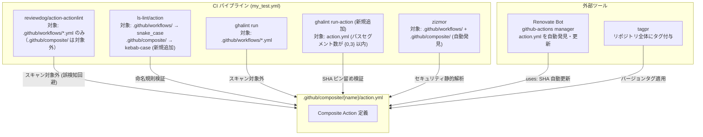

# Design Document

## Overview

本ドキュメントは、`kryota-dev/actions` リポジトリに Composite Actions サポートを追加するための技術設計を定義する。

変更の全体像は以下の4点に集約される:

1. **ディレクトリ構造の追加**: `.github/composite/{action-name}/action.yml` の格納場所を新設
2. **ls-lint 設定の拡張**: `.github/composite/` ディレクトリの kebab-case 命名規則を追加
3. **CI パイプラインの拡張**: `my_test.yml` に `ghalint run-action` ステップを追加
4. **README の更新**: Composite Actions の利用方法を追記

既存の Reusable Workflows、リリース管理（tagpr）、zizmor、Renovate Bot は**設定変更不要**で Composite Actions に対応できる。

## Steering Document Alignment

### 技術基準（既存コーディング規約）

- `uses:` は full commit SHA（40文字）でピン留め（`ghalint` / `zizmor` で CI 検証）
- Renovate Bot により SHA を自動更新
- `permissions: {}` をトップレベルに設定し、各 job で最小権限のみ付与
- `timeout-minutes` を全 job に設定

### プロジェクト構造規約

- `.github/workflows/` 配下の `.yml`: snake_case（ls-lint で強制）
- 内部 CI ワークフロー: `my_` プレフィックス
- Composite Actions は `.github/composite/` 配下に分離（actionlint の誤検知を回避）

## Code Reuse Analysis

### 既存コンポーネントの活用

| コンポーネント | 活用方法 |
|---|---|
| `aqua.yaml` の `ghalint@v1.5.5` | `ghalint run-action` コマンドは v1.5.1 以降でサポート。現行バージョン v1.5.5 で使用可能。新規インストール不要 |
| `my_test.yml` の aqua-installer ステップ | 既存の aqua セットアップステップの後に `ghalint run-action` ステップを追加するだけでよい |
| `renovate.json5` の `helpers:pinGitHubActionDigests` | Renovate の `github-actions` マネージャーはデフォルトで `/(^|/)action\.ya?ml$/` パターンに一致するファイルをスキャンするため、`.github/composite/` 配下の `action.yml` も**追加設定不要**で自動更新対象となる |
| `uvx zizmor --format=github .` | リポジトリルートを指定しているため、`.github/composite/` 配下の `action.yml` も**追加設定不要**で自動スキャン対象となる（zizmor v1.0.0 以降） |
| `.tagpr` / `my_release.yml` | タグはリポジトリ全体に適用されるため、`.github/composite/` 配下の Composite Actions も同一タグで参照可能。**設定変更不要** |

### 変更が必要なファイル

| ファイル | 変更種別 | 変更内容 |
|---|---|---|
| `.ls-lint.yml` | 修正 | 設定キーを `ls-lint:` → `ls:` に修正（既存バグ修正）＋ `.github/composite/` の kebab-case ルール追加 |
| `.github/workflows/my_test.yml` | 修正 | `ghalint run-action` ステップ追加 |
| `README.md` | 修正 | Composite Actions サブセクション追加 |
| `.github/composite/` | 新規作成 | ディレクトリ（`.gitkeep` を配置して Git 管理下に置く） |

## Architecture

### ディレクトリ構造（To-Be）

```
.github/
  composite/                    # Composite Actions 格納ディレクトリ（新規）
    {action-name}/              # 各 Action のサブディレクトリ（kebab-case）
      action.yml                # Composite Action 定義ファイル
  workflows/
    my_test.yml                 # CI: ghalint run-action ステップ追加
    my_setup_pr.yml             # 変更なし
    my_release.yml              # 変更なし
    my_codeql.yml               # 変更なし
  rulesets/                     # 変更なし
  CODEOWNERS                    # 変更なし
  release.yml                   # 変更なし
.ls-lint.yml                    # 変更: .github/composite/ ルール追加
README.md                       # 変更: Composite Actions セクション追加
aqua.yaml                       # 変更なし（ghalint は run-action も使用可能）
renovate.json5                  # 変更なし
```

### ツールと Composite Actions の対応関係



### actionlint が `.github/composite/` を誤検知しない仕組み

`reviewdog/action-actionlint` Action は内部的に actionlint を `.github/workflows/` ディレクトリに対してのみ実行する。`.github/composite/` は `workflows/` ディレクトリとは別パスに存在するため、actionlint のスキャン対象に含まれない。`.github/composite/` へ分離配置することで、追加設定なしに誤検知を回避できる。

### ghalint run vs run-action の使い分け

| コマンド | 対象 | 用途 |
|---|---|---|
| `ghalint run` | `.github/workflows/*.yml` | Reusable Workflows / 内部 CI の検証（既存） |
| `ghalint run-action` | `^([^/]+/){0,3}action\.ya?ml$` にマッチするファイル | Composite Actions の `action.yml` 検証（新規追加） |

`.github/composite/{action-name}/action.yml` のパスは `.github/` / `composite/` / `{action-name}/` の3セグメントを持つ。正規表現パターン `^([^/]+/){0,3}action\.ya?ml$` における `([^/]+/)` が3回マッチする構造であり、上限 `{0,3}` に収まるため検証対象となる。

## Components and Interfaces

### Component 1: `.github/composite/` ディレクトリ構造

- **Purpose:** Composite Actions を格納する。actionlint の誤検知を避けるため `workflows/` と分離する
- **命名規則:** サブディレクトリ名は kebab-case（ls-lint で強制）
- **初期状態の管理:** 空ディレクトリは Git 管理できないため `.github/composite/.gitkeep` を配置する。ls-lint の `.yml: regex:action` ルールは `.yml` ファイルのみを対象とするため `.gitkeep` への誤検知は発生しない
- **action.yml の必須フィールド:**
  ```yaml
  name: # Action の表示名
  description: # Action の説明（GitHub UI での視認性）
  inputs:      # 入力パラメータ（任意だが明示的に定義を推奨）
  outputs:     # 出力パラメータ（任意だが明示的に定義を推奨）
  runs:
    using: "composite"
    steps:
      - shell: bash  # run ステップには必ず shell を明記
  ```
- **外部参照形式:** `kryota-dev/actions/.github/composite/{action-name}@{tag-or-sha}`

### Component 2: `.ls-lint.yml` の変更

- **Purpose:** `.github/composite/` 配下のディレクトリ・ファイル命名規則を CI で強制する
- **既存バグの修正:** 現行の `.ls-lint.yml` では `ls-lint:` キーを使用しているが、ls-lint の全バージョン（v1/v2）で正式なトップレベルキーは `ls:` である。`ls-lint:` キーは認識されないため、現行 CI は実質チェックが機能していない可能性がある。本変更と合わせてキーを修正する。
- **現在の設定（バグあり）:**
  ```yaml
  ls-lint:
    .github/workflows:
      .yml: snake_case
  ```
- **変更後の設定（キー修正 + Composite Actions ルール追加）:**
  ```yaml
  ls:
    .github/workflows:
      .yml: snake_case
    .github/composite:
      .dir: kebab-case
      .yml: regex:action
  ```
  - `ls-lint:` → `ls:`: ls-lint の正式なトップレベルキーに修正（既存バグ修正）
  - `.dir: kebab-case`: サブディレクトリ名（Action 名）を kebab-case に強制
  - `.yml: regex:action`: `action.yml` のみを許可（`action.yaml` は GitHub の仕様上 `action.yml` が推奨）

### Component 3: `my_test.yml` への `ghalint run-action` ステップ追加

- **Purpose:** Composite Actions の `action.yml` に対して ghalint によるセキュリティポリシー検証を実施する
- **バージョン要件:** `ghalint run-action` は v1.5.1 以降でサポート。現行 `aqua.yaml` の `ghalint@v1.5.5` で使用可能
- **変更箇所:** 既存の `Run ghalint` ステップの直後に `Run ghalint run-action` ステップを追加
- **変更後の関連ステップ:**
  ```yaml
  - name: Run ghalint
    run: ghalint run
    shell: bash

  - name: Run ghalint run-action
    run: ghalint run-action
    shell: bash
  ```
  - aqua によって ghalint はすでにインストール・PATH 設定済みのため、追加のセットアップステップは不要
  - `ghalint run-action` はカレントディレクトリ配下の `action.yml` を再帰的に検索して検証する

### Component 4: `README.md` の変更

- **Purpose:** Composite Actions の利用者が参照方法をすぐに把握できるドキュメントを提供する
- **方針:** 既存の `## Usage` セクションおよび `## Available Workflows` セクションの構造を維持し、サブセクションの追加のみを行う（大幅な構造変更は避ける）

  **現在の構造（変更なし）:**
  ```markdown
  ## Usage

  他のリポジトリから Reusable Workflow を参照する場合は...（既存内容）

  ## Available Workflows

  ### Reusable Workflows

  Coming soon.

  ### Internal CI Workflows
  ...
  ```

  **変更後の構造（追加箇所のみ示す）:**
  ```markdown
  ## Usage

  他のリポジトリから Reusable Workflow を参照する場合は...（既存内容そのまま）

  ### Composite Actions の利用方法（新規追加）

  他のリポジトリから Composite Action を参照する場合は以下の形式を使用します:

  \```yaml
  steps:
    - uses: kryota-dev/actions/.github/composite/{action-name}@vX
      with:
        # inputs
  \```

  バージョンはメジャータグ（例: `v1`）または完全なバージョンタグ（例: `v1.0.0`）で指定してください。

  ## Available Workflows

  ### Reusable Workflows

  Coming soon.

  ### Composite Actions（新規追加）

  Coming soon.

  ### Internal CI Workflows
  ...（既存内容そのまま）
  ```

  **追加内容:**
  - `## Usage` セクション末尾に「Composite Actions の利用方法」サブセクションを追加
  - `## Available Workflows` セクションに「Composite Actions」サブセクション（`Coming soon.`）を追加

## Data Models

### action.yml の構造テンプレート

Composite Action の `action.yml` は以下の構造に従う:

```yaml
name: "{Action の表示名}"
description: "{Action の説明}"

inputs:
  {input-name}:
    description: "{入力の説明}"
    required: true | false
    default: "{デフォルト値（任意）}"

outputs:
  {output-name}:
    description: "{出力の説明}"
    value: ${{ steps.{step-id}.outputs.{output} }}

runs:
  using: "composite"
  steps:
    - name: "{ステップ名}"
      id: "{step-id}"
      shell: bash
      env:
        INPUT_VAR: ${{ inputs.{input-name} }}  # inputs は env 経由で渡す
      run: |
        # シェルスクリプト
        echo "result=value" >> "$GITHUB_OUTPUT"
```

**設計上の制約:**
- `inputs` の値を `run` ステップに直接埋め込んではならない（テンプレートインジェクション対策）
- 環境変数経由（`env:` キー）で渡すこと
- Composite Actions は `secrets:` をサポートしないため、シークレットが必要な場合は `inputs:` 経由で渡す

## Error Handling

### エラーシナリオ

1. **ls-lint: ディレクトリ名が kebab-case でない場合**
   - **検出:** CI の ls-lint ステップがエラーを報告
   - **対処:** ディレクトリ名を kebab-case に修正（例: `setupNode` → `setup-node`）

2. **ghalint run-action: `uses:` がミュータブルタグの場合**
   - **検出:** CI の `ghalint run-action` ステップがエラーを報告
   - **対処:** `uses:` を full commit SHA + コメント形式に変更（例: `uses: actions/checkout@{SHA} # v4`）

3. **zizmor: テンプレートインジェクション検出**
   - **検出:** CI の zizmor ステップがエラーを報告
   - **対処:** `${{ inputs.xxx }}` を直接 `run:` に埋め込まず、`env:` 経由で環境変数として渡す

4. **actionlint: `.github/composite/` を誤って検証した場合（想定外）**
   - **検出:** CI の actionlint ステップが `action.yml` に対してエラーを報告
   - **対処:** `reviewdog/action-actionlint` の設定でスキャンパスを `.github/workflows/` に明示的に限定する（通常は発生しない）

## Testing Strategy

本機能は GitHub Actions のインフラ設定であるため、従来的な Unit / Integration / E2E テストではなく、以下のアプローチで品質を保証する。

### CI による自動検証（主要テスト手段）

PR 作成時に `my_test.yml` が以下を自動検証する:

| ステップ | 検証内容 |
|---|---|
| ls-lint | `.github/composite/` 配下のディレクトリ名が kebab-case であること |
| ghalint run-action | `action.yml` 内の `uses:` が full commit SHA でピン留めされていること |
| zizmor | `action.yml` にテンプレートインジェクション等のセキュリティ問題がないこと |

### 手動検証項目

実装後に以下を手動で確認する:

1. **ls-lint の動作確認**
   - `.github/composite/` 配下に kebab-case のサブディレクトリと `action.yml` を配置し、CI が通過すること
   - 違反ディレクトリ名（例: `setupNode`）を含む PR を作成し、CI が失敗すること

2. **ghalint run-action の動作確認**
   - SHA ピン留め済みの `action.yml` を含む PR で CI が通過すること
   - ミュータブルタグ（`@v4`）を含む `action.yml` で CI が失敗すること

3. **zizmor の自動検出確認**
   - `uvx zizmor --format=github .` が `.github/composite/` 配下の `action.yml` をスキャン対象に含めることを確認

4. **Renovate の自動更新確認**
   - Renovate が `.github/composite/` 配下の `action.yml` 内の `uses:` を更新 PR として作成することを確認（初回 Renovate 実行後）

5. **外部参照の動作確認**
   - 別リポジトリのワークフローから `kryota-dev/actions/.github/composite/{action-name}@vX` の形式で参照し、正常に動作することを確認
