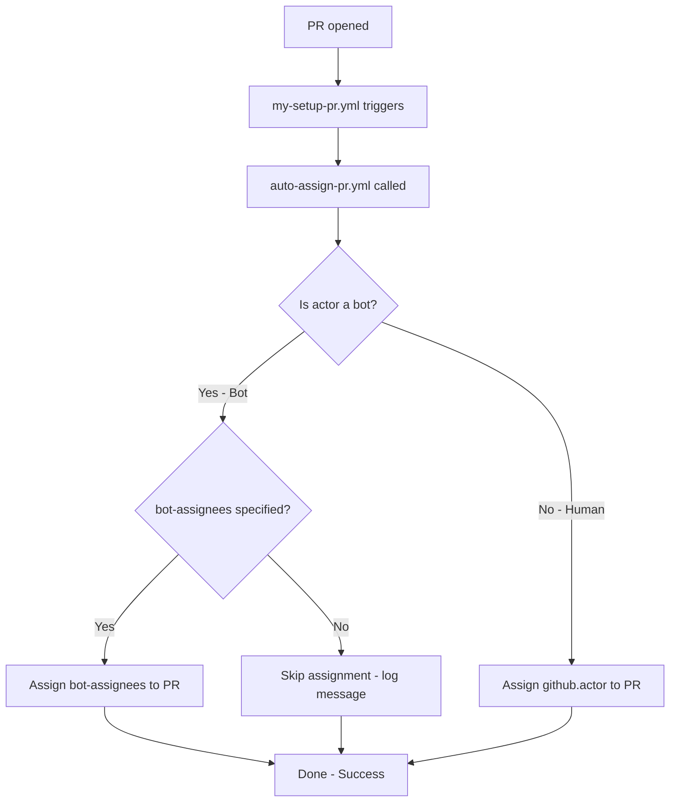

# Design Document

## Overview

`auto-assign-pr.yml` Reusable Workflow を修正し、Bot ユーザーが作成した PR で失敗しないようにする。Bot PR の場合は呼び出し元が指定した代替アサイン先にアサインし、指定がなければスキップする。通常ユーザーの PR では従来通り PR 作成者をアサインする。

## Steering Document Alignment

### Technical Standards
- GitHub Actions YAML のみで実装（TypeScript/JavaScript なし）
- SHA ピン留めルール遵守（外部 Action 使用なし、`gh` CLI のみなので該当なし）
- actionlint / ghalint / zizmor の CI チェックを通過すること

### Project Structure
- `auto-assign-pr.yml`: Reusable Workflow（`.github/workflows/` に配置）
- `my-setup-pr.yml`: 内部 CI 薄いラッパー（`.github/workflows/` に配置）
- `auto-assign-pr.md`: ワークフロードキュメント（`.github/workflows/docs/` に配置）

## Code Reuse Analysis

### Existing Components to Leverage
- **`auto-assign-pr.yml`**: 既存の Reusable Workflow。`workflow_call` の inputs に `bot-assignees` パラメータを追加し、Bot 判定ロジックとアサイン分岐を追加する
- **`my-setup-pr.yml`**: 既存の薄いラッパー。`with` で `bot-assignees` を渡すよう修正する

### Integration Points
- **`workflow_call` インターフェース**: `inputs.bot-assignees`（string, optional, default: ''）を追加。既存の呼び出し元は変更不要（後方互換）

## Architecture

Bot 判定は `github.actor` の末尾が `[bot]` であるかどうかで行う。

> **重要**: `github.actor_type` は GitHub Actions の公式コンテキストに存在しないため使用しない。`github.actor` の文字列パターンマッチで Bot を判定する。



### Modular Design Principles
- **Single File Responsibility**: Bot 判定とアサインロジックは `auto-assign-pr.yml` 内で完結
- **Component Isolation**: `my-setup-pr.yml` は `with` パラメータの追加のみ。ロジックは Reusable Workflow に委譲
- **Clear Interfaces**: `workflow_call.inputs.bot-assignees` が唯一のインターフェース追加

## Components and Interfaces

### Component 1: `auto-assign-pr.yml`（Reusable Workflow）

- **Purpose:** PR 作成者の自動アサイン。Bot PR の場合は代替アサインまたはスキップ
- **Interfaces:**
  - `workflow_call.inputs.bot-assignees`（string, required: false, default: ''）: Bot PR 時のアサイン先（カンマ区切り）
- **Dependencies:** `gh` CLI（GitHub-hosted runner に標準搭載）
- **Reuses:** 既存の `gh pr edit --add-assignee` パターン

#### 実装詳細

```yaml
on:
  workflow_call:
    inputs:
      bot-assignees:
        description: 'Comma-separated list of users/teams to assign for bot PRs (empty = skip)'
        required: false
        type: string
        default: ''

jobs:
  add_assignee:
    runs-on: ubuntu-latest
    timeout-minutes: 5
    permissions:
      pull-requests: write
    steps:
      - name: Check if actor is a bot
        id: check-bot
        run: |
          if [[ "$ACTOR" == *"[bot]" ]]; then
            echo "is_bot=true" >> "$GITHUB_OUTPUT"
            echo "::notice::Actor '$ACTOR' is a bot"
          else
            echo "is_bot=false" >> "$GITHUB_OUTPUT"
          fi
        env:
          ACTOR: ${{ github.actor }}

      - name: Assign PR creator (human)
        if: steps.check-bot.outputs.is_bot == 'false'
        run: gh pr edit "$PR_URL" --add-assignee "$ACTOR"
        env:
          GH_TOKEN: ${{ github.token }}
          PR_URL: ${{ github.event.pull_request.html_url }}
          ACTOR: ${{ github.actor }}

      - name: Assign bot-assignees (bot with assignees specified)
        if: steps.check-bot.outputs.is_bot == 'true' && inputs.bot-assignees != ''
        run: |
          IFS=',' read -ra ASSIGNEES <<< "$BOT_ASSIGNEES"
          for assignee in "${ASSIGNEES[@]}"; do
            trimmed=$(echo "$assignee" | xargs)
            echo "Assigning '$trimmed' to PR"
            gh pr edit "$PR_URL" --add-assignee "$trimmed"
          done
        env:
          GH_TOKEN: ${{ github.token }}
          PR_URL: ${{ github.event.pull_request.html_url }}
          BOT_ASSIGNEES: ${{ inputs.bot-assignees }}

      - name: Skip assignment (bot without assignees)
        if: steps.check-bot.outputs.is_bot == 'true' && inputs.bot-assignees == ''
        run: echo "::notice::Skipping assignment for bot actor '$ACTOR' (no bot-assignees specified)"
        env:
          ACTOR: ${{ github.actor }}
```

### Component 2: `my-setup-pr.yml`（内部 CI ラッパー）

- **Purpose:** `auto-assign-pr.yml` を呼び出す薄いラッパー。`bot-assignees` に `kryota-dev` を指定
- **Interfaces:** なし（内部 CI）
- **Dependencies:** `auto-assign-pr.yml`

#### 実装詳細

```yaml
jobs:
  auto-assign:
    permissions:
      pull-requests: write
    uses: ./.github/workflows/auto-assign-pr.yml
    with:
      bot-assignees: 'kryota-dev'
```

### Component 3: `auto-assign-pr.md`（ドキュメント更新）

- **Purpose:** `bot-assignees` パラメータの追加をドキュメントに反映
- **Interfaces:** N/A
- **Dependencies:** N/A

## Data Models

N/A（YAML ワークフローのみ。データベースやモデルは不要）

## Error Handling

### Error Scenarios
1. **Bot PR で `bot-assignees` に無効なユーザー名が指定された場合**
   - **Handling:** `gh pr edit --add-assignee` がエラーを返すが、他のアサイン先の処理は継続しない（ステップが失敗しワークフローは失敗終了）
   - **User Impact:** ワークフロー失敗として表示される。正しいユーザー名を設定する必要がある
   - **備考:** 呼び出し元が正しいユーザー名を指定する責任を持つ。無効な名前のバリデーションはスコープ外

2. **`github.actor` の判定ミス（Bot なのに `[bot]` で終わらないケース）**
   - **Handling:** 通常ユーザーとして扱い、`gh pr edit --add-assignee` が実行される。アサインできない場合はエラーとなる
   - **User Impact:** ワークフロー失敗。ただし、GitHub の主要 Bot（dependabot, renovate, github-actions 等）はすべて `[bot]` サフィックスを持つため、実質的なリスクは低い

## Testing Strategy

### Unit Testing
- GitHub Actions YAML にはユニットテストの仕組みがないため、CI パイプラインでの動作確認が主な検証手段

### Integration Testing
- **通常ユーザー PR**: 手動で PR を作成し、アサインが正常に動作することを確認
- **Bot PR**: Renovate Bot が PR を作成した際に、`kryota-dev` がアサインされることを確認

### Lint / Static Analysis
- `actionlint`: ワークフロー構文チェック
- `ghalint`: セキュリティポリシー検証
- `zizmor`: テンプレートインジェクション等の静的セキュリティ分析
