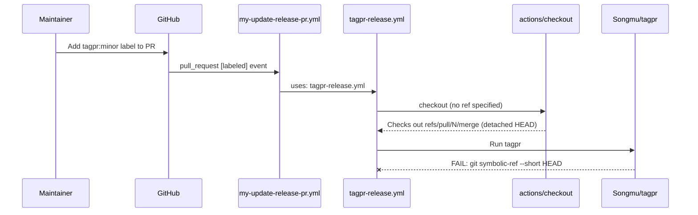
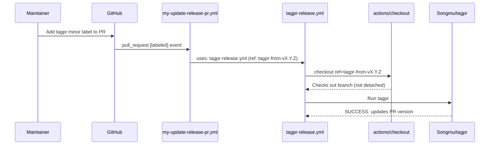

# Design Document

## Overview

Fix the detached HEAD problem in `tagpr-release.yml` when invoked from `my-update-release-pr.yml` via the `pull_request: [labeled]` event. The root cause is that `actions/checkout` defaults to the merge commit (`refs/pull/N/merge`) for `pull_request` events, which produces a detached HEAD that tagpr cannot handle.

The fix adds an optional `ref` input to `tagpr-release.yml` so callers can explicitly specify a branch to check out.

## Code Reuse Analysis

### Existing Pattern to Leverage
- **`deploy-web-hosting.yml`**: Already uses an optional `ref-name` input pattern with `workflow_call`. This establishes a precedent for passing ref overrides to Reusable Workflows.
- **`compute-web-hosting-deploy-path/action.yml`**: Demonstrates how to handle `pull_request` vs `push` event contexts for ref resolution (using `github.head_ref` vs `github.ref_name`).

### Integration Points
- **`tagpr-release.yml`**: Add optional `ref` input to `workflow_call`, use it in `actions/checkout`
- **`my-update-release-pr.yml`**: Pass `github.event.pull_request.head.ref` as the `ref` input
- **`my-release.yml`**: No changes needed (omitting `ref` preserves existing default behavior)

## Architecture

### Call Flow (Current - Broken)



### Call Flow (Fixed)



## Components and Interfaces

### tagpr-release.yml (Modified)

- **Change:** Add optional `ref` input to `workflow_call`
- **Interface:**
  ```yaml
  on:
    workflow_call:
      inputs:
        ref:
          description: "Git ref to checkout (default: event-driven)"
          type: string
          required: false
          default: ''
      secrets:
        app-token:
          required: true
  ```
- **Checkout step change:** Add `ref: ${{ inputs.ref || '' }}` to the `tagpr` job's checkout step
- **`bump_major_tag` job:** No changes needed. This job only runs when `tagpr.outputs.tag != ''`, which only happens on push-to-main (where checkout works correctly by default).

### my-update-release-pr.yml (Modified)

- **Change:** Pass `ref` input when calling `tagpr-release.yml`
- **Interface:**
  ```yaml
  uses: ./.github/workflows/tagpr-release.yml
  with:
    ref: ${{ github.event.pull_request.head.ref }}
  secrets:
    app-token: ${{ secrets.APP_TOKEN }}
  ```

### my-release.yml (No Changes)

- Continues to call `tagpr-release.yml` without the `ref` input
- `inputs.ref` defaults to `''`, which means `actions/checkout` uses its default behavior (checking out the pushed branch)

## Error Handling

### Edge Case: Empty ref input
- **Handling:** `${{ inputs.ref || '' }}` evaluates to empty string, which causes `actions/checkout` to use its default event-driven behavior
- **Impact:** No change to existing `my-release.yml` flow

### Edge Case: PR head branch deleted
- **Handling:** If the branch is deleted before the workflow runs, `actions/checkout` will fail with a ref-not-found error. This is acceptable behavior — the workflow should not proceed if the branch no longer exists.

## Testing Strategy

### Manual Testing
1. Merge this fix to `main`
2. Wait for tagpr to create a new release PR
3. Add `tagpr:minor` label to the release PR
4. Verify `update-release-pr / tagpr` job succeeds
5. Verify the release PR title reflects the minor version bump

### Verification of Existing Flow
1. After merging the fix, verify `my-release.yml` triggers and tagpr creates the release PR normally
2. Verify `bump_major_tag` job continues to work on actual releases
