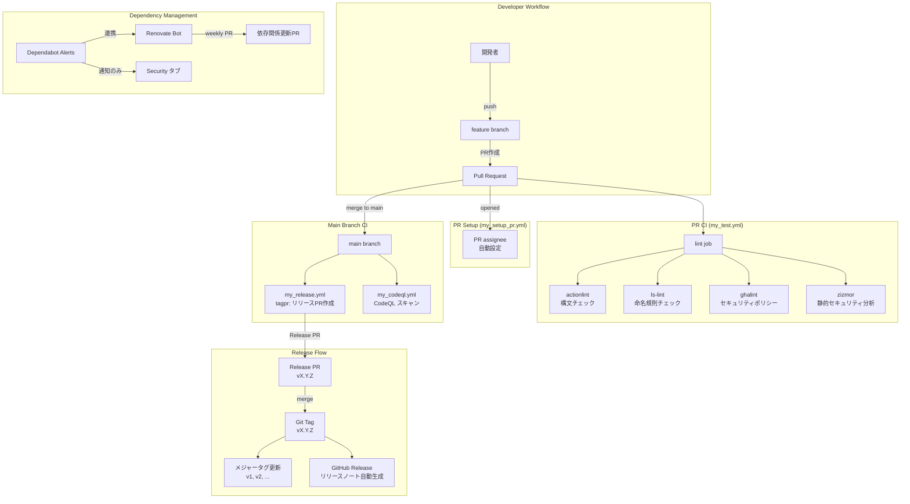

# Design Document

## Overview

本ドキュメントは、GitHub Actions の Reusable Workflow を管理するリポジトリ（`kryota-dev/actions`）の基盤環境構築の設計を定義する。

現時点のリポジトリには README.md / LICENSE / .gitignore / .envrc のみが存在しており、以下の基盤コンポーネントを新規に追加する:

1. **Workflow Lint・セキュリティチェック** - ls-lint / actionlint / ghalint / zizmor
2. **内部 CI ワークフロー群** - my_test / my_setup_pr / my_release / my_codeql
3. **リリース管理** - tagpr + .tagpr + .github/release.yml
4. **依存関係管理** - Renovate Bot (renovate.json5) + Dependabot Alerts
5. **ADR 管理** - adr npm パッケージ + .adr.json
6. **リポジトリ設定** - CODEOWNERS + README 更新

参考リポジトリ: [route06/actions](https://github.com/route06/actions)

---

## Steering Document Alignment

### Technical Standards

- **SHA ピン留めポリシー**: 全ての `uses:` 指定は `action/name@<full-commit-sha> # vX.Y.Z` 形式とする。ghalint および zizmor により CI でミュータブルタグ参照を強制検出する。
- **命名規則**: Reusable Workflow はそのまま機能名 (`snake_case.yml`)、内部 CI Workflow は `my_` プレフィックス (`my_*.yml`)
- **secrets 管理**: `APP_TOKEN`（PAT: Personal Access Token）はリポジトリシークレットで管理
- **permissions 最小化**: 各 Workflow ジョブは必要最小限の permissions を明示宣言する

### Project Structure

```
(リポジトリルート)
├── .adr.json                          # ADR 設定
├── .gitignore                         # 既存（direnv用）
├── .ls-lint.yml                       # ls-lint 命名規則設定
├── .tagpr                             # tagpr リリース設定
├── package.json                       # adr devDependency
├── package-lock.json                  # (npm install で生成)
├── renovate.json5                     # Renovate Bot 設定
├── README.md                          # 既存（更新）
├── LICENSE                            # 既存
├── CHANGELOG.md                       # tagpr が自動生成
├── .github/
│   ├── CODEOWNERS                     # コードオーナー設定
│   ├── release.yml                    # リリースノートカテゴリ
│   └── workflows/
│       ├── my_codeql.yml              # 内部CI: CodeQL スキャン
│       ├── my_release.yml             # 内部CI: tagpr リリース
│       ├── my_setup_pr.yml            # 内部CI: PR assignee設定
│       └── my_test.yml                # 内部CI: Lint・セキュリティチェック
└── docs/
    └── adr/                           # ADR ドキュメント格納先
```

---

## Code Reuse Analysis

### 既存コードの活用

本リポジトリは現時点ではほぼ空の状態であるため、既存コードの再利用は限定的である。ただし以下の外部 Reusable Workflow / Action を活用する:

| 用途 | Action / Tool |
|---|---|
| チェックアウト | `actions/checkout` |
| tagpr リリース管理 | `Songmu/tagpr` |
| actionlint 実行 | `reviewdog/action-actionlint` |
| ls-lint 実行 | `ls-lint/action` |
| zizmor 実行 | `zizmorcore/zizmor-action` または `uvx zizmor` |
| ghalint 実行 | `aquaproj/aqua-installer` + `ghalint run` |

### Integration Points

- **tagpr**: mainブランチへのpushをトリガーにリリースPRを自動管理。PAT（`APP_TOKEN`）が必要。
- **Renovate Bot**: GitHub App として組織/リポジトリにインストール済みであることを前提とする。`renovate.json5` で動作設定。
- **Dependabot Alerts**: GitHub リポジトリの Security 設定で有効化（`.github/dependabot.yml` は作成しない）。

---

## Architecture

### 全体アーキテクチャ



### Modular Design Principles

- **Single File Responsibility**: 各 Workflow ファイルは1つのCI/CDの目的に特化。テスト・リリース・セキュリティスキャン・PR設定を別ファイルに分離
- **Component Isolation**: 内部CI (`my_*`) と公開Reusable Workflow を `my_` プレフィックスで明確に分離
- **Service Layer Separation**: lint チェック群は `my_test.yml` の単一 job に集約し、ジョブ数を最小化
- **Utility Modularity**: 外部 Action はそれぞれ独立したステップとして組み込み、独立した設定ファイル（`.ls-lint.yml`, `ghalint.yaml` 等）で制御

---

## Components and Interfaces

### Component 1: my_test.yml（Lint・セキュリティチェック）

- **Purpose**: PR に対してワークフローファイルの構文・命名規則・セキュリティポリシーを一括検証する品質ゲート
- **トリガー**: `pull_request`, `merge_group`
- **Concurrency**: `cancel-in-progress: true`（同一PR上の古い実行をキャンセル）
- **Job 構成**: 単一 job（`lint`）に4ツールをステップとして順次実行

**設計詳細:**

```yaml
# .github/workflows/my_test.yml
name: test
on:
  pull_request:
  merge_group:

concurrency:
  group: ${{ github.workflow }}-${{ github.ref }}
  cancel-in-progress: true

permissions: {}

jobs:
  lint:
    runs-on: ubuntu-latest
    permissions:
      contents: read
      pull-requests: write  # reviewdog が PR コメントを書くために必要
    steps:
      # Step 1: checkout
      - uses: actions/checkout@<sha> # v4

      # Step 2: actionlint (reviewdog 経由)
      - uses: reviewdog/action-actionlint@<sha> # v1
        with:
          reporter: github-pr-review

      # Step 3: ls-lint
      - uses: ls-lint/action@<sha> # v2

      # Step 4: ghalint (aqua 経由)
      - uses: aquaproj/aqua-installer@<sha> # v3
        with:
          aqua_version: v2.x.x
      - run: ghalint run
        shell: bash

      # Step 5: zizmor
      - uses: astral-sh/setup-uv@<sha> # v6
      - run: uvx zizmor --format=github .
        env:
          GH_TOKEN: ${{ secrets.GITHUB_TOKEN }}
```

- **Dependencies**: `reviewdog/action-actionlint`, `ls-lint/action`, `aquaproj/aqua-installer`, `astral-sh/setup-uv`
- **Reuses**: 外部 Action を直接利用

### Component 2: my_release.yml（リリース管理）

- **Purpose**: mainブランチへのpushを受け tagprによるリリースPR管理と、マージ後のタグ付け・メジャータグ更新を行う
- **トリガー**: `push` (branches: [main])
- **Job 構成**: 2ジョブ（`tagpr` → `bump_major_tag`）

**設計詳細:**

```yaml
# .github/workflows/my_release.yml
name: release
on:
  push:
    branches: [main]

permissions: {}

jobs:
  tagpr:
    runs-on: ubuntu-latest
    permissions:
      contents: write
      pull-requests: write
    outputs:
      tag: ${{ steps.tagpr.outputs.tag }}
    steps:
      - uses: actions/checkout@<sha> # v4
        with:
          token: ${{ secrets.APP_TOKEN }}
      - uses: Songmu/tagpr@<sha> # v1
        id: tagpr
        env:
          GITHUB_TOKEN: ${{ secrets.APP_TOKEN }}

  bump_major_tag:
    needs: tagpr
    if: needs.tagpr.outputs.tag != ''
    runs-on: ubuntu-latest
    permissions:
      contents: write
    steps:
      - uses: actions/checkout@<sha> # v4
        with:
          token: ${{ secrets.APP_TOKEN }}
      - name: Update major tag
        env:
          TAG: ${{ needs.tagpr.outputs.tag }}
          GITHUB_TOKEN: ${{ secrets.APP_TOKEN }}
        run: |
          MAJOR="${TAG%%.*}"
          git tag -f "$MAJOR"
          git push origin "$MAJOR" --force
```

- **Dependencies**: `actions/checkout`, `Songmu/tagpr`
- **Secrets**: `APP_TOKEN`（PAT: Personal Access Token。tagpr が main ブランチへの push と PR 作成を行うため、通常の `GITHUB_TOKEN` では Branch Protection Rules をバイパスできず PAT が必要）

> **PAT と permissions の関係**: `permissions` ブロックは `GITHUB_TOKEN` のスコープを制御する。PAT（`APP_TOKEN`）は `GITHUB_TOKEN` と独立した認証であり、PAT のスコープは PAT 発行時に設定する（`repo` および `workflow` スコープが必要）。ghalint の `job_permissions` ポリシーを通過させるために `permissions` 宣言は引き続き必要。

### Component 3: my_setup_pr.yml（PR セットアップ）

- **Purpose**: PR作成時に作成者を自動で assignee に設定する
- **トリガー**: `pull_request` (types: [opened])
- **設計方針**: 将来的にリポジトリ内に `add_assignee_to_pr.yml` Reusable Workflow を追加した場合はそれを呼び出す。初期段階では直接 GitHub CLI / API を使用するか、シンプルな実装とする。

```yaml
# .github/workflows/my_setup_pr.yml
name: setup_pr
on:
  pull_request:
    types: [opened]

permissions: {}

jobs:
  add_assignee:
    runs-on: ubuntu-latest
    permissions:
      pull-requests: write
    steps:
      - name: Add assignee
        run: gh pr edit "$PR_URL" --add-assignee "$ACTOR"
        env:
          GH_TOKEN: ${{ secrets.GITHUB_TOKEN }}
          PR_URL: ${{ github.event.pull_request.html_url }}
          ACTOR: ${{ github.actor }}
```

- **Dependencies**: GitHub CLI（ubuntu-latest にプリインストール。`gh pr edit` は checkout 不要）

### Component 4: my_codeql.yml（CodeQL セキュリティスキャン）

- **Purpose**: メインブランチおよびPRに対して CodeQL による静的解析を継続実行し、セキュリティ脆弱性を早期発見する
- **トリガー**: `push` (branches: [main]), `pull_request`, `merge_group`

```yaml
# .github/workflows/my_codeql.yml
name: codeql
on:
  push:
    branches: [main]
  pull_request:
  merge_group:

permissions: {}

jobs:
  analyze:
    runs-on: ubuntu-latest
    permissions:
      actions: read
      contents: read
      security-events: write
    strategy:
      matrix:
        language: [actions]
    steps:
      - uses: actions/checkout@<sha> # v4
      - uses: github/codeql-action/init@<sha> # v3
        with:
          languages: ${{ matrix.language }}
      - uses: github/codeql-action/analyze@<sha> # v3
```

- **Dependencies**: `actions/checkout`, `github/codeql-action/init`, `github/codeql-action/analyze`

### Component 5: 設定ファイル群

#### .tagpr

```ini
[tagpr]
vPrefix = true
releaseBranch = main
versionFile = -
```

#### .ls-lint.yml

```yaml
ls-lint:
  .github/workflows:
    .yml: snake_case
```

#### .adr.json

```json
{
  "path": "docs/adr/",
  "digits": 3,
  "language": "en"
}
```

#### package.json

```json
{
  "scripts": {
    "adr:new": "adr new"
  },
  "devDependencies": {
    "adr": "^x.x.x"
  }
}
```

#### renovate.json5

```json5
{
  "$schema": "https://docs.renovatebot.com/renovate-schema.json",
  "extends": [
    "config:recommended",
    "helpers:pinGitHubActionDigests"
  ],
  "schedule": ["every weekend"],
  "labels": ["Maintenance"],
  "vulnerabilityAlerts": {
    "labels": ["[SECURITY]"],
    "schedule": ["at any time"]
  }
}
```

**設計ポイント:**
- `helpers:pinGitHubActionDigests`: Actions を自動的に full commit SHA ピン留めし、コメントにバージョンタグを付与
- `vulnerabilityAlerts`: Dependabot Alerts 連携。セキュリティ脆弱性は `[SECURITY]` ラベル付きで即時 PR 作成
- 週末スケジュール: 定期的な依存関係更新は週末に集約

#### .github/CODEOWNERS

```
* @kryota-dev
```

#### .github/release.yml

```yaml
changelog:
  categories:
    - title: Breaking Changes
      labels: [breaking-change]
    - title: New Features
      labels: [enhancement]
    - title: Fix bug
      labels: [bug]
    - title: Maintenance
      labels: [maintenance, dependencies]
    - title: Other Changes
      labels: ["*"]
```

#### ghalint 設定（ghalint.yaml）

ghalint はデフォルトで `.github/workflows/` を自動スキャンする。必要に応じて特定ポリシーの除外設定を記述:

```yaml
# ghalint.yaml（必要な場合のみ）
excludes: []
```

---

## Data Models

本実装は設定ファイルの集合であるため、従来のデータモデルは存在しない。各設定ファイルのスキーマが「データモデル」に相当する。

### Workflow トリガーマトリクス

| ワークフロー | pull_request | push(main) | merge_group | PR opened |
|---|---|---|---|---|
| my_test.yml | o | - | o | - |
| my_setup_pr.yml | - | - | - | o |
| my_release.yml | - | o | - | - |
| my_codeql.yml | o | o | o | - |

### Secrets マトリクス

| ワークフロー | GITHUB_TOKEN | APP_TOKEN (PAT) |
|---|---|---|
| my_test.yml | o (zizmor) | - |
| my_setup_pr.yml | o | - |
| my_release.yml | - | o |
| my_codeql.yml | - | - |

---

## Error Handling

### Error Scenarios

1. **ghalint: SHA ピン留め違反**
   - **Handling**: ghalint が `ghalint run` 実行時にエラーを出力し、CI が非ゼロ終了コードで失敗
   - **Resolution**: 違反している `uses:` をfull commit SHA に変更する。Renovate Bot が自動修正 PR を作成することも期待できる

2. **actionlint: 構文エラー**
   - **Handling**: reviewdog 経由で PR にインラインコメントを付与。CI ステータスチェックが失敗
   - **Resolution**: コメントを参照して Workflow ファイルの構文を修正

3. **zizmor: テンプレートインジェクション検出**
   - **Handling**: `--format=github` 出力により GitHub Annotations として表示。CI が非ゼロ終了で失敗
   - **Resolution**: `${{ github.event.xxx }}` 等の直接参照を環境変数経由に変更

4. **tagpr: PAT 認証エラー**
   - **Handling**: ワークフローが失敗し、エラーログに認証エラーが出力される
   - **Resolution**: リポジトリシークレット `APP_TOKEN` に有効な PAT が設定されているか確認。PAT には `repo` および `workflow` スコープが必要

5. **ls-lint: 命名規則違反**
   - **Handling**: ls-lint がエラーを出力し、CI が失敗
   - **Resolution**: 違反しているファイル名を snake_case に変更（`git mv` でリネーム）

---

## Testing Strategy

本実装は設定ファイルと Workflow ファイルの集合であり、従来のユニットテスト・インテグレーションテストではなく、CI 自身が品質検証機能を担う。

### Workflow ファイルの静的検証（CI による自動テスト）

- **actionlint**: 全 Workflow ファイルの構文・型チェック
- **ghalint**: セキュリティポリシー準拠チェック（SHA ピン留め / permissions / secrets）
- **zizmor**: 静的セキュリティ分析（テンプレートインジェクション / サプライチェーン）
- **ls-lint**: ファイル名命名規則チェック

### 設定ファイルの検証（手動確認）

1. **tagpr 動作確認**: mainブランチへの実際の push でリリースPRが自動作成されることを確認
2. **Renovate Bot 動作確認**: 初回設定後にRenovateがリポジトリをスキャンしてPRを作成することを確認
3. **CODEOWNERS 確認**: PRを作成して `@kryota-dev` が自動アサインされることを確認
4. **ADR コマンド確認**: `npm run adr:new -- "Initial setup"` でADRスケルトンが生成されることを確認

### セキュリティ検証（ghalint + zizmor による自己検証）

- 作成した内部 CI ワークフロー自体が ghalint / zizmor による検証対象となる
- 全ての `uses:` が SHA ピン留め形式であることを CI で自動検証
- 各 Job が適切な `permissions` を宣言していることを CI で自動検証

---

## SHA ピン留め実装ガイドライン

### ルール

全ての `uses:` 指定は以下の形式とする:

```yaml
uses: actions/checkout@11bd71901bbe5b1630ceea73d27597364c9af683 # v4
```

- full commit SHA（40文字）を使用
- コメントにバージョンタグを付与（人間の可読性確保）
- Renovate Bot が SHA を自動更新する

### Renovate Bot との連携

`helpers:pinGitHubActionDigests` プリセットにより:
1. 未ピン留めの Action を自動検出して SHA ピン留め PR を作成
2. 新しいバージョンリリース時に SHA を更新する PR を自動作成
3. PR タイトルにコメントのバージョンタグが反映される

### ghalint によるポリシー強制

ghalint は以下のポリシーでミュータブルタグ参照を検出:
- `action_ref_should_be_full_length_commit_sha` - `uses:` が full commit SHA でない場合にエラー
- `job_permissions` - `permissions` 未宣言または過剰宣言を検出
- `workflow_secrets` - credentials 漏洩パターンを検出
- `job_timeout_minutes_is_required` - `timeout-minutes` 未設定を検出（必要に応じて適用）
