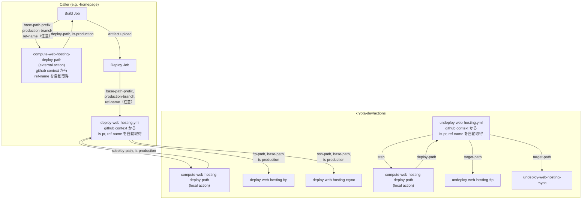

# Design Document: web-hosting-deploy-path

## Overview

デプロイパス計算ロジックを `compute-web-hosting-deploy-path` Composite Action として共通化し、`deploy-web-hosting.yml` / `undeploy-web-hosting.yml` Reusable Workflows の入力を簡素化する。

Composite Actions と Reusable Workflows は `github` コンテキスト（`github.event_name`, `github.head_ref`, `github.ref_name`）に直接アクセスできるため、多くのイベント情報を inputs で受け取る必要はない。利用側（caller）は `base-path-prefix`（プロジェクト固有プレフィックス）と `production-branch` を渡すだけで、パス計算・本番判定が自動的に行われる。

## Code Reuse Analysis

### Existing Components to Leverage

- **`deploy-web-hosting-ftp` / `deploy-web-hosting-rsync` Composite Actions**: インターフェース変更なし。既存の `base-path` / `ftp-path` / `ssh-path` / `is-production` 入力はそのまま利用。パス計算結果を受け取るのみ
- **`undeploy-web-hosting-ftp` / `undeploy-web-hosting-rsync` Composite Actions**: インターフェース変更なし。既存の `target-path` 入力はそのまま利用

### Integration Points

- **`deploy-web-hosting.yml`**: 新しい compute ステップを追加し、計算結果を後続ステップで参照
- **`undeploy-web-hosting.yml`**: 同様に compute ステップを追加
- **caller 側のビルドジョブ**: `compute-web-hosting-deploy-path` を外部 Action として利用し、ビルド用パスを取得

## Architecture



## GitHub Context の利用

### アクセス可能なコンテキスト

公式ドキュメントにより、Composite Actions と Reusable Workflows の両方で `github` コンテキストにアクセス可能。Reusable Workflow の場合、`github` コンテキストは常に呼び出し元（caller）のワークフローに関連付けられる。

### ref-name の導出ロジック

`github` コンテキストから以下のように ref-name を自動導出する（`ref-name` オーバーライドが未指定の場合）：

```bash
# github コンテキストから ref-name を導出
if [ "$EVENT_NAME" = "pull_request" ]; then
  # PR イベント: head_ref（PRのソースブランチ名）を使用
  REF_NAME="$HEAD_REF"
else
  # push / repository_dispatch / workflow_dispatch: ref_name を使用
  REF_NAME="$REF_NAME_CTX"
fi
```

| Event | `github.event_name` | 導出される ref-name | 説明 |
|-------|---------------------|---------------------|------|
| `pull_request` | `pull_request` | `github.head_ref` | PR のソースブランチ名 |
| `push` | `push` | `github.ref_name` | プッシュ先ブランチ名 |
| `repository_dispatch` | `repository_dispatch` | `github.ref_name` | **デフォルトブランチ名**（注意: 本番ブランチとは限らない） |
| `workflow_dispatch` | `workflow_dispatch` | `github.ref_name` | 実行元ブランチ名 |

> **重要: `repository_dispatch` と `ref-name` オーバーライド**
>
> `repository_dispatch` は常にデフォルトブランチで実行される。しかし、デフォルトブランチと本番ブランチが異なるケースがある（例: デフォルトブランチ = `develop`、本番ブランチ = `main`）。
>
> そのような環境では、`github.ref_name` が本番ブランチ名を返さないため、caller 側で `ref-name` オーバーライドを明示的に指定する必要がある：
> ```yaml
> ref-name: ${{ github.event_name == 'repository_dispatch' && 'main' || '' }}
> ```
>
> デフォルトブランチ = 本番ブランチの環境では、`ref-name` オーバーライドは不要（`github.ref_name` がそのまま正しい値を返す）。

### is-pr の導出

```
is_pr = (github.event_name == 'pull_request')
```

これにより、既存の `is-pr` 入力が不要になる。

## Components and Interfaces

### Component 1: `compute-web-hosting-deploy-path` Composite Action

- **Purpose**: `github` コンテキストとプレフィックスからデプロイパスと本番判定を計算する
- **Location**: `.github/actions/compute-web-hosting-deploy-path/action.yml`
- **Dependencies**: なし（純粋な bash 計算のみ、checkout 不要）

#### Inputs

| Name | Required | Default | Description |
|------|----------|---------|-------------|
| `base-path-prefix` | false | `''` | プロジェクト固有パスプレフィックス（例: `/<your-project>`） |
| `production-branch` | false | `'main'` | 本番ブランチ名 |
| `ref-name` | false | `''` | ブランチ名のオーバーライド（未指定時は `github` コンテキストから自動導出） |

#### Outputs

| Name | Description | Example |
|------|-------------|---------|
| `deploy-path` | 完全なデプロイパス | `/<your-project>/_feature/feature-something` or `/<your-project>` |
| `is-production` | 本番デプロイかどうか | `true` or `false` |
| `ref-name` | 実際に使用された ref-name（導出またはオーバーライド値） | `feature-branch` or `main` |

#### Logic

```bash
# 0. ref-name の決定: オーバーライドがあればそれを使用、なければ github コンテキストから導出
if [ -n "$REF_NAME_OVERRIDE" ]; then
  REF_NAME="$REF_NAME_OVERRIDE"
elif [ "$EVENT_NAME" = "pull_request" ]; then
  REF_NAME="$HEAD_REF"
else
  REF_NAME="$REF_NAME_CTX"
fi

# 1. バリデーション
if [ -z "$REF_NAME" ]; then
  echo "::error::ref-name is empty. Cannot compute deploy path."
  exit 1
fi

# 2. ブランチ名のサニタイズ: '/' を '-' に置換
SANITIZED_REF=$(echo "$REF_NAME" | tr '/' '-')

# 3. 本番判定
if [ "$REF_NAME" = "$PRODUCTION_BRANCH" ]; then
  IS_PRODUCTION="true"
  FEATURE_SUFFIX=""
else
  IS_PRODUCTION="false"
  FEATURE_SUFFIX="/_feature/${SANITIZED_REF}"
fi

# 4. 完全パスの生成
DEPLOY_PATH="${BASE_PATH_PREFIX}${FEATURE_SUFFIX}"
```

#### action.yml の env 参照パターン

Composite Action 内で `github` コンテキストを参照する際は、`env` 経由でシェル変数に渡す：

```yaml
- name: Compute deploy path
  shell: bash
  env:
    EVENT_NAME: ${{ github.event_name }}
    HEAD_REF: ${{ github.head_ref }}
    REF_NAME_CTX: ${{ github.ref_name }}
    REF_NAME_OVERRIDE: ${{ inputs.ref-name }}
    BASE_PATH_PREFIX: ${{ inputs.base-path-prefix }}
    PRODUCTION_BRANCH: ${{ inputs.production-branch }}
  run: |
    # ... logic above ...
```

### Component 2: `deploy-web-hosting.yml` Reusable Workflow（変更）

- **Purpose**: ビルド成果物を Web Hosting にデプロイする（パス計算と PR 判定を内部化）
- **Dependencies**: `compute-web-hosting-deploy-path`, `deploy-web-hosting-ftp`, `deploy-web-hosting-rsync`

#### Input Changes

| Input | Change | Before | After |
|-------|--------|--------|-------|
| `is-pr` | **削除** | `boolean, required: true` | - （`github.event_name` から導出） |
| `base-path` | **削除** | `string, required: false` | - |
| `is-production` | **削除** | `string, required: false` | - |
| `base-path-prefix` | **追加** | - | `string, required: false, default: ''` |
| `production-branch` | **追加** | - | `string, required: false, default: 'main'` |
| `ref-name` | **追加** | - | `string, required: false, default: ''`（`repository_dispatch` 等でのオーバーライド用） |
| `deploy-type` | 変更なし | | |
| `artifact-name` | 変更なし | | |
| `output-dir` | 変更なし | | |
| `home-url` | 変更なし | | |
| `dry-run` | 変更なし | | |

#### New Step: Compute deploy path

ジョブの最初のステップとして追加（artifact download の前）:

```yaml
- name: Compute deploy path
  id: compute-path
  uses: ./.github/actions/compute-web-hosting-deploy-path
  with:
    base-path-prefix: ${{ inputs.base-path-prefix }}
    production-branch: ${{ inputs.production-branch }}
    ref-name: ${{ inputs.ref-name }}
```

#### 後続ステップの参照変更

| 箇所 | Before | After |
|------|--------|-------|
| FTP deploy: `ftp-path` | `${{ secrets.server-path }}${{ inputs.base-path }}` | `${{ secrets.server-path }}${{ steps.compute-path.outputs.deploy-path }}` |
| FTP deploy: `base-path` | `${{ inputs.base-path }}` | `${{ steps.compute-path.outputs.deploy-path }}` |
| FTP deploy: `is-production` | `${{ inputs.is-production }}` | `${{ steps.compute-path.outputs.is-production }}` |
| rsync deploy: `ssh-path` | `${{ secrets.server-path }}${{ inputs.base-path }}` | `${{ secrets.server-path }}${{ steps.compute-path.outputs.deploy-path }}` |
| rsync deploy: `base-path` | `${{ inputs.base-path }}` | `${{ steps.compute-path.outputs.deploy-path }}` |
| rsync deploy: `is-production` | `${{ inputs.is-production }}` | `${{ steps.compute-path.outputs.is-production }}` |
| PR comment: `DEPLOY_URL` | `${{ inputs.home-url }}${{ inputs.base-path }}/` | `${{ inputs.home-url }}${{ steps.compute-path.outputs.deploy-path }}/` |
| PR comment if 条件 | `${{ success() && inputs.is-pr }}` | `${{ success() && github.event_name == 'pull_request' }}` |
| Slack notification if 条件 | `${{ success() && !inputs.is-pr && ... }}` | `${{ success() && github.event_name != 'pull_request' && ... }}` |

### Component 3: `undeploy-web-hosting.yml` Reusable Workflow（変更）

- **Purpose**: Web Hosting からフィーチャーデプロイを削除する（パス計算を内部化）
- **Dependencies**: `compute-web-hosting-deploy-path`, `undeploy-web-hosting-ftp`, `undeploy-web-hosting-rsync`

#### Input Changes

| Input | Change | Before | After |
|-------|--------|--------|-------|
| `base-path` | **削除** | `string, required: true` | - |
| `is-pr` | **削除** | `boolean, required: true` | - （`github.event_name` から導出） |
| `base-path-prefix` | **追加** | - | `string, required: false, default: ''` |
| `ref-name` | **追加** | - | `string, required: false, default: ''`（`workflow_dispatch` 時のオーバーライド用） |
| `deploy-type` | 変更なし | | |
| `dry-run` | 変更なし | | |

> **Note**: undeploy workflow は以下のケースで `ref-name` オーバーライドが必要：
> - `workflow_dispatch` 経由の手動実行（`github.head_ref` が空になるため）
> - `repository_dispatch` 経由（デフォルトブランチ ≠ 本番ブランチの環境）

#### New Step: Compute deploy path

```yaml
- name: Compute deploy path
  id: compute-path
  uses: ./.github/actions/compute-web-hosting-deploy-path
  with:
    base-path-prefix: ${{ inputs.base-path-prefix }}
    ref-name: ${{ inputs.ref-name }}
```

#### 後続ステップの参照変更

| 箇所 | Before | After |
|------|--------|-------|
| FTP undeploy: `target-path` | `${{ secrets.server-path }}${{ inputs.base-path }}` | `${{ secrets.server-path }}${{ steps.compute-path.outputs.deploy-path }}` |
| rsync undeploy: `target-path` | `${{ secrets.server-path }}${{ inputs.base-path }}` | `${{ secrets.server-path }}${{ steps.compute-path.outputs.deploy-path }}` |
| PR comment if 条件 | `${{ success() && inputs.is-pr }}` | `${{ success() && github.event_name == 'pull_request' }}` |

## Error Handling

### Error Scenarios

1. **ref-name が空文字（導出もオーバーライドも空）**
   - **Handling**: `compute-web-hosting-deploy-path` でバリデーションし、エラー終了（`exit 1`）
   - **User Impact**: ワークフローが失敗し、ログにエラーメッセージが表示される

2. **ブランチ名に `/` が含まれる**
   - **Handling**: `tr '/' '-'` によるサニタイズ（例: `feature/something` → `feature-something`）
   - **User Impact**: サニタイズされたパスが使用される

## Testing Strategy

### Manual Testing

- PR 作成時のデプロイパスが `/_feature/{sanitized-branch-name}` になることを確認
- 本番ブランチへのプッシュ時にパスが空（= ルートデプロイ）になることを確認
- `production-branch` を `main` 以外（例: `develop`）に設定して正しく動作することを確認
- undeploy 時に正しいパスが削除されることを確認
- `dry-run: true` で計算結果がログに表示されることを確認
- `ref-name` オーバーライドが正しく動作することを確認
- デフォルトブランチ ≠ 本番ブランチ環境での `repository_dispatch` 時にオーバーライドが正しく機能することを確認

### Validation Checklist

- [ ] `actionlint` が通ること
- [ ] `ghalint run` / `ghalint run-action` が通ること
- [ ] 既存の FTP/rsync Composite Actions のインターフェースが変わっていないこと

## Migration Guide (Breaking Changes)

### Caller 側の変更

**deploy workflow (push / PR):**
```yaml
# Before
uses: kryota-dev/actions/.github/workflows/deploy-web-hosting.yml@...
with:
  is-pr: ${{ github.event_name == 'pull_request' }}
  base-path: ${{ needs.build.outputs.base-path }}
  is-production: ${{ needs.build.outputs.is-production }}

# After（is-pr, is-production は自動導出されるため不要）
uses: kryota-dev/actions/.github/workflows/deploy-web-hosting.yml@...
with:
  base-path-prefix: ${{ vars.NEXT_PUBLIC_BASE_PATH || '' }}
  production-branch: 'main'
```

**deploy workflow (repository_dispatch, デフォルトブランチ ≠ 本番ブランチの場合):**
```yaml
# After（ref-name オーバーライドで本番ブランチを明示的に指定）
uses: kryota-dev/actions/.github/workflows/deploy-web-hosting.yml@...
with:
  base-path-prefix: ${{ vars.NEXT_PUBLIC_BASE_PATH || '' }}
  production-branch: 'main'
  ref-name: ${{ github.event_name == 'repository_dispatch' && 'main' || '' }}
```

**undeploy workflow (PR close):**
```yaml
# Before
with:
  is-pr: ${{ github.event_name == 'pull_request' }}
  base-path: ${{ needs.compute.outputs.base-path }}

# After（github コンテキストから自動導出）
with:
  base-path-prefix: ${{ vars.NEXT_PUBLIC_BASE_PATH || '' }}
```

**undeploy workflow (workflow_dispatch):**
```yaml
# After（手動実行時は ref-name オーバーライドが必要）
with:
  base-path-prefix: ${{ vars.NEXT_PUBLIC_BASE_PATH || '' }}
  ref-name: ${{ github.event.inputs.branch_name }}
```

**build job での base-path 取得:**
```yaml
# Before: inline shell script
- name: Set BASE_PATH
  run: echo "base_path=..." >> "$GITHUB_OUTPUT"
- name: Set is-production
  run: echo "is_production=..." >> "$GITHUB_OUTPUT"

# After: composite action（github コンテキストから自動導出）
- name: Compute deploy path
  id: compute-path
  uses: kryota-dev/actions/.github/actions/compute-web-hosting-deploy-path@...
  with:
    base-path-prefix: ${{ vars.NEXT_PUBLIC_BASE_PATH || '' }}
    production-branch: 'main'
# outputs: steps.compute-path.outputs.deploy-path, steps.compute-path.outputs.is-production
```

**不要になるもの:**
- `is-pr` 入力の設定
- `Set is-production` ステップ
- `Set BASE_PATH` ステップ内のパスサフィックス計算ロジック

**環境に応じて必要なもの:**
- デフォルトブランチ ≠ 本番ブランチの環境: `repository_dispatch` 時の `ref-name` オーバーライド
- `workflow_dispatch` による手動 undeploy: `ref-name` オーバーライド
